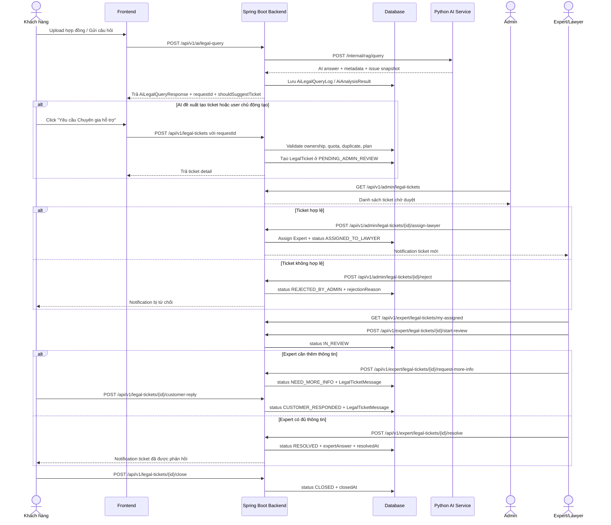
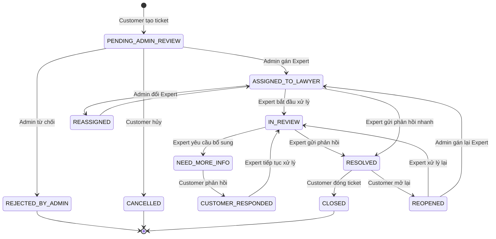

# Tài liệu Đặc tả Tính năng Legal Ticket  
## Bản cập nhật: Cover lỗi, Edge Case & Luồng xử lý thực tế

Tài liệu này mô tả chi tiết tính năng **Legal Ticket** trong hệ thống AI Legal-Tech: khi AI phát hiện hợp đồng có điều khoản rủi ro, độ tin cậy thấp, thiếu thông tin hoặc cần chuyên gia pháp lý rà soát, hệ thống cho phép khách hàng tạo ticket để Admin duyệt và gán cho Chuyên gia/Luật sư xử lý.

> Mục tiêu của bản cập nhật này:
>
> - Không chỉ cover **happy path**, mà cover cả lỗi nghiệp vụ, lỗi quyền truy cập, duplicate request, quota/gói dịch vụ, concurrency và trạng thái mở lại ticket.
> - Không tin metadata AI do Frontend gửi lên. Backend phải lấy lại dữ liệu từ AI query log hoặc AI analysis result đã lưu.
> - Lưu snapshot điều khoản hợp đồng có vấn đề để ticket vẫn có giá trị ngay cả khi tài liệu gốc bị xóa hoặc thay đổi.
> - Thiết kế đủ tốt để chia task cho Backend, Frontend và AI Service.

---

# 1. Tổng quan nghiệp vụ

## 1.1. Legal Ticket là gì?

**Legal Ticket** là vé hỗ trợ pháp lý được tạo khi:

1. AI phân tích hợp đồng và phát hiện điều khoản rủi ro.
2. AI có độ tin cậy thấp khi trả lời.
3. Câu hỏi pháp lý của khách hàng cần chuyên gia xác minh.
4. Khách hàng chủ động muốn chuyên gia xem lại kết quả AI.
5. Expert cần trao đổi thêm thông tin với khách hàng trước khi kết luận.

## 1.2. Actor tham gia

| Actor | Mô tả |
|---|---|
| `CUSTOMER` | Người dùng upload hợp đồng, hỏi AI và tạo ticket |
| `ADMIN` | Quản trị viên duyệt ticket, từ chối ticket, gán hoặc đổi chuyên gia |
| `EXPERT` | Chuyên gia pháp lý/luật sư xử lý ticket |
| `AI_SERVICE` | External service phân tích hợp đồng, sinh câu trả lời và metadata rủi ro |

---

# 2. Luồng hoạt động End-to-End

## 2.1. Luồng tổng quát có kiểm soát



---

# 3. Sơ đồ trạng thái Ticket



---

# 4. Enum đề xuất

## 4.1. `LegalTicketStatus`

```java
public enum LegalTicketStatus {
    PENDING_ADMIN_REVIEW,
    REJECTED_BY_ADMIN,
    ASSIGNED_TO_LAWYER,
    REASSIGNED,
    IN_REVIEW,
    NEED_MORE_INFO,
    CUSTOMER_RESPONDED,
    RESOLVED,
    CLOSED,
    CANCELLED,
    REOPENED
}
```

## 4.2. `SuggestionType`

```java
public enum SuggestionType {
    NONE,
    ASK_MORE_INFO,
    SUGGEST_LAWYER,
    REQUIRE_LAWYER
}
```

## 4.3. `RiskLevel`

```java
public enum RiskLevel {
    LOW,
    MEDIUM,
    HIGH,
    CRITICAL
}
```

## 4.4. `UserActionHint`

```java
public enum UserActionHint {
    CONTINUE_CHAT,
    PROVIDE_MORE_INFO,
    CREATE_TICKET
}
```

## 4.5. `TicketCreationSource`

```java
public enum TicketCreationSource {
    AI_SUGGESTED,
    USER_MANUAL,
    ADMIN_CREATED
}
```

## 4.6. `TicketPriority`

```java
public enum TicketPriority {
    LOW,
    NORMAL,
    HIGH,
    URGENT
}
```

## 4.7. `LegalTicketMessageType`

```java
public enum LegalTicketMessageType {
    CUSTOMER_MESSAGE,
    EXPERT_MESSAGE,
    ADMIN_NOTE,
    SYSTEM_EVENT
}
```

---

# 5. Database Entity chính: `LegalTicket`

## 5.1. Nguyên tắc thiết kế quan trọng

1. **Không hard delete ticket pháp lý**: dùng soft delete để giữ lịch sử tư vấn.
2. **Không tin metadata từ Frontend**: Backend lấy lại metadata từ `AiLegalQueryLog` hoặc `AiAnalysisResult`.
3. **Phải lưu snapshot vấn đề hợp đồng**: ticket vẫn có giá trị khi document bị xóa hoặc thay đổi.
4. **Phải chống duplicate ticket**: tránh user bấm nhiều lần hoặc frontend retry.
5. **Phải có `@Version`**: tránh hai Admin/Expert update cùng một ticket gây mất dữ liệu.

## 5.2. Bảng `legal_tickets`

| Thuộc tính Java | Kiểu dữ liệu | Cột DB | Ràng buộc | Mô tả |
|---|---:|---|---|---|
| `id` | `String` | `id` | `@Id` | ID dạng `ticket_xxx` |
| `requestId` | `String` | `request_id` | `nullable = false` | ID lượt AI query gốc |
| `issueFingerprint` | `String` | `issue_fingerprint` | `nullable = true` | Hash định danh vấn đề để chống duplicate |
| `createdBy` | `User` | `created_by_id` | `@ManyToOne`, `nullable = false` | Customer tạo ticket |
| `workspace` | `Workspace` | `workspace_id` | `@ManyToOne`, `nullable = true` | Workspace liên quan. Không nên cascade delete ticket |
| `document` | `Document` | `document_id` | `@ManyToOne`, `nullable = true` | Document liên quan. Nếu document bị xóa thì set null |
| `question` | `String` | `question` | `TEXT`, `nullable = false` | Câu hỏi gốc của người dùng |
| `aiAnswer` | `String` | `ai_answer` | `TEXT` | Câu trả lời ban đầu của AI |
| `confidenceScore` | `Double` | `confidence_score` | `0.0 - 1.0` | Điểm tin cậy của AI |
| `shouldSuggestTicket` | `Boolean` | `should_suggest_ticket` | `BOOLEAN` | AI có đề xuất ticket không |
| `suggestionType` | `SuggestionType` | `suggestion_type` | `Enum` | Loại đề xuất |
| `suggestionReason` | `String` | `suggestion_reason` | `TEXT` | Lý do AI đề xuất ticket |
| `missingInformation` | `String` | `missing_information` | `TEXT` | Thông tin cần bổ sung |
| `riskLevel` | `RiskLevel` | `risk_level` | `Enum` | Mức độ rủi ro pháp lý |
| `legalDomain` | `String` | `legal_domain` | `VARCHAR(255)` | Lĩnh vực pháp lý |
| `userActionHint` | `UserActionHint` | `user_action_hint` | `Enum` | Gợi ý hành động cho UI |
| `creationSource` | `TicketCreationSource` | `creation_source` | `Enum`, `nullable = false` | Ticket do AI đề xuất hay user tạo thủ công |
| `priority` | `TicketPriority` | `priority` | `Enum`, default `NORMAL` | Độ ưu tiên |
| `status` | `LegalTicketStatus` | `status` | `Enum`, `nullable = false` | Trạng thái hiện tại |
| `assignedLawyer` | `User` | `assigned_lawyer_id` | `@ManyToOne`, `nullable = true` | Expert được gán xử lý |
| `assignedAt` | `LocalDateTime` | `assigned_at` | `nullable = true` | Thời điểm assign |
| `resolvedAt` | `LocalDateTime` | `resolved_at` | `nullable = true` | Thời điểm expert resolve |
| `closedAt` | `LocalDateTime` | `closed_at` | `nullable = true` | Thời điểm customer đóng ticket |
| `cancelledAt` | `LocalDateTime` | `cancelled_at` | `nullable = true` | Thời điểm hủy |
| `reopenedAt` | `LocalDateTime` | `reopened_at` | `nullable = true` | Thời điểm mở lại |
| `expertAnswer` | `String` | `expert_answer` | `TEXT`, `nullable = true` | Phản hồi chính thức từ chuyên gia |
| `expertInternalNote` | `String` | `expert_internal_note` | `TEXT`, `nullable = true` | Ghi chú nội bộ, không hiển thị cho Customer |
| `adminNote` | `String` | `admin_note` | `TEXT`, `nullable = true` | Ghi chú của Admin |
| `rejectionReason` | `String` | `rejection_reason` | `TEXT`, `nullable = true` | Lý do Admin từ chối |
| `deleted` | `Boolean` | `deleted` | default `false` | Soft delete |
| `deletedAt` | `LocalDateTime` | `deleted_at` | `nullable = true` | Thời điểm soft delete |
| `createdAt` | `LocalDateTime` | `created_at` | `nullable = false` | Thời điểm tạo |
| `updatedAt` | `LocalDateTime` | `updated_at` | `nullable = false` | Thời điểm cập nhật |
| `version` | `Long` | `version` | `@Version` | Optimistic locking |

## 5.3. Snapshot vấn đề hợp đồng

Nên thêm các field này trực tiếp trong `LegalTicket` để Expert hiểu rõ AI phát hiện vấn đề gì:

| Thuộc tính Java | Kiểu dữ liệu | Cột DB | Mô tả |
|---|---:|---|---|
| `issueTitle` | `String` | `issue_title` | Tiêu đề vấn đề, ví dụ: “Điều khoản phạt vi phạm quá cao” |
| `issueSummary` | `String` | `issue_summary` | Tóm tắt vấn đề |
| `problematicClause` | `String` | `problematic_clause` | Đoạn điều khoản có rủi ro |
| `clauseReference` | `String` | `clause_reference` | Ví dụ: “Điều 7.2 - Phạt vi phạm” |
| `pageNumber` | `Integer` | `page_number` | Trang chứa điều khoản |
| `aiEvidence` | `String` | `ai_evidence` | Lý do AI đánh giá có rủi ro |
| `recommendedAction` | `String` | `recommended_action` | Gợi ý hành động ban đầu |
| `legalBasis` | `String` | `legal_basis` | Căn cứ pháp lý AI trích xuất, nếu có |

Ví dụ:

```json
{
  "issue_title": "Điều khoản phạt vi phạm vượt giới hạn",
  "issue_summary": "Hợp đồng quy định phạt 30% giá trị nghĩa vụ vi phạm, có thể vượt mức pháp luật cho phép.",
  "problematic_clause": "Bên vi phạm phải chịu phạt 30% tổng giá trị hợp đồng.",
  "clause_reference": "Điều 8.1",
  "page_number": 4,
  "ai_evidence": "AI phát hiện mức phạt có khả năng vượt ngưỡng cho phép trong giao dịch thương mại.",
  "recommended_action": "Nên yêu cầu chuyên gia kiểm tra và đề xuất sửa điều khoản."
}
```

## 5.4. Unique constraint chống duplicate

Nếu một AI request chỉ tạo tối đa một ticket:

```java
@Table(
    name = "legal_tickets",
    uniqueConstraints = {
        @UniqueConstraint(
            name = "uk_legal_ticket_request_creator",
            columnNames = {"request_id", "created_by_id"}
        )
    }
)
```

Nếu một AI request có thể phát hiện nhiều vấn đề khác nhau trong cùng hợp đồng:

```java
@Table(
    name = "legal_tickets",
    uniqueConstraints = {
        @UniqueConstraint(
            name = "uk_legal_ticket_request_issue_creator",
            columnNames = {"request_id", "issue_fingerprint", "created_by_id"}
        )
    }
)
```

Khuyến nghị cho dự án phân tích hợp đồng: **dùng cách thứ hai** vì một hợp đồng có thể có nhiều điều khoản lỗi.

---

# 6. Entity phụ: `LegalTicketMessage`

Nếu chỉ có field `expertAnswer`, hệ thống chỉ hỗ trợ “Customer hỏi một lần, Expert trả lời một lần”. Để xử lý case Expert cần thêm thông tin hoặc Customer phản hồi lại, nên có bảng message.

## 6.1. Bảng `legal_ticket_messages`

| Thuộc tính Java | Kiểu dữ liệu | Cột DB | Mô tả |
|---|---:|---|---|
| `id` | `String` | `id` | ID dạng `msg_xxx` |
| `ticket` | `LegalTicket` | `ticket_id` | Ticket liên quan |
| `sender` | `User` | `sender_id` | Người gửi |
| `messageType` | `LegalTicketMessageType` | `message_type` | Loại message |
| `content` | `String` | `content` | Nội dung message |
| `internalOnly` | `Boolean` | `internal_only` | Nếu true chỉ Admin/Expert xem |
| `createdAt` | `LocalDateTime` | `created_at` | Thời điểm gửi |

## 6.2. Khi nào tạo message?

| Hành động | MessageType |
|---|---|
| Customer bổ sung thông tin | `CUSTOMER_MESSAGE` |
| Expert yêu cầu thêm thông tin | `EXPERT_MESSAGE` |
| Admin ghi chú nội bộ | `ADMIN_NOTE` |
| Hệ thống đổi trạng thái | `SYSTEM_EVENT` |

---

# 7. Entity khuyến nghị: `AiLegalQueryLog`

Để Backend không tin metadata từ Frontend, nên lưu kết quả AI query vào DB.

## 7.1. Bảng `ai_legal_query_logs`

| Thuộc tính Java | Kiểu dữ liệu | Cột DB | Mô tả |
|---|---:|---|---|
| `id` | `String` | `id` | ID dạng `query_xxx` |
| `user` | `User` | `user_id` | Người gửi query |
| `workspace` | `Workspace` | `workspace_id` | Workspace liên quan |
| `document` | `Document` | `document_id` | Document liên quan |
| `question` | `String` | `question` | Câu hỏi gốc |
| `aiAnswer` | `String` | `ai_answer` | Câu trả lời AI |
| `confidenceScore` | `Double` | `confidence_score` | Điểm tin cậy |
| `shouldSuggestTicket` | `Boolean` | `should_suggest_ticket` | Có đề xuất ticket không |
| `riskLevel` | `RiskLevel` | `risk_level` | Mức độ rủi ro |
| `legalDomain` | `String` | `legal_domain` | Lĩnh vực pháp lý |
| `issueSnapshotJson` | `String` | `issue_snapshot_json` | JSON chứa danh sách vấn đề AI phát hiện |
| `createdAt` | `LocalDateTime` | `created_at` | Thời điểm tạo |

## 7.2. Luồng tạo ticket an toàn

Frontend **không gửi lại toàn bộ metadata AI**. Frontend chỉ gửi:

```json
{
  "request_id": "query_abc123",
  "workspace_id": 1,
  "document_id": 5,
  "issue_fingerprint": "hash_issue_001",
  "creation_source": "AI_SUGGESTED"
}
```

Backend tự load `AiLegalQueryLog` theo `request_id`, sau đó copy metadata hợp lệ sang `LegalTicket`.

---

# 8. REST API Endpoints cập nhật

## 8.1. API dành cho Customer

### 8.1.1. Gửi câu hỏi/phân tích pháp lý bằng AI

```http
POST /api/v1/ai/legal-query
```

**Quyền:** `CUSTOMER`, `ADMIN`

**Mô tả:** Gửi câu hỏi hoặc yêu cầu phân tích hợp đồng lên AI service.

**Response nên có:**

```json
{
  "request_id": "query_abc123",
  "answer": "AI answer...",
  "confidence_score": 0.61,
  "should_suggest_ticket": true,
  "suggestion_type": "SUGGEST_LAWYER",
  "risk_level": "HIGH",
  "legal_domain": "Commercial Contract",
  "user_action_hint": "CREATE_TICKET",
  "issues": [
    {
      "issue_fingerprint": "hash_issue_001",
      "issue_title": "Điều khoản phạt vi phạm quá cao",
      "clause_reference": "Điều 8.1",
      "page_number": 4
    }
  ]
}
```

---

### 8.1.2. Tạo ticket

```http
POST /api/v1/legal-tickets
```

**Quyền:** `CUSTOMER`, `ADMIN`

**Request Body:**

```json
{
  "request_id": "query_abc123",
  "workspace_id": 1,
  "document_id": 5,
  "issue_fingerprint": "hash_issue_001",
  "creation_source": "AI_SUGGESTED",
  "customer_note": "Tôi muốn luật sư kiểm tra kỹ điều khoản này."
}
```

**Quy tắc quan trọng:**

- Backend validate `request_id` có tồn tại không.
- Backend validate `workspace_id` thuộc user hiện tại không.
- Backend validate `document_id` có thuộc workspace không.
- Backend lấy metadata AI từ DB, không tin data FE.
- Backend kiểm tra duplicate ticket.
- Backend kiểm tra gói dịch vụ/quota expert review.

---

### 8.1.3. Xem danh sách ticket của tôi

```http
GET /api/v1/legal-tickets/my
```

**Query params đề xuất:**

```http
?status=RESOLVED&page=0&size=10&sort=createdAt,desc
```

---

### 8.1.4. Xem chi tiết ticket

```http
GET /api/v1/legal-tickets/{id}
```

**Quyền:**

- Customer chỉ xem ticket do mình tạo.
- Admin xem toàn bộ.
- Expert chỉ xem ticket được gán cho mình.

---

### 8.1.5. Customer hủy ticket

```http
POST /api/v1/legal-tickets/{id}/cancel
```

Chỉ cho hủy khi ticket ở:

- `PENDING_ADMIN_REVIEW`
- `ASSIGNED_TO_LAWYER` nếu Expert chưa bắt đầu `IN_REVIEW`

**Request Body:**

```json
{
  "reason": "Tôi không cần chuyên gia hỗ trợ nữa."
}
```

---

### 8.1.6. Customer bổ sung thông tin

```http
POST /api/v1/legal-tickets/{id}/customer-reply
```

Chỉ dùng khi ticket ở:

- `NEED_MORE_INFO`
- `REOPENED`

**Request Body:**

```json
{
  "message": "Tôi bổ sung thêm phụ lục hợp đồng và thông tin giao dịch."
}
```

---

### 8.1.7. Customer đóng ticket

```http
POST /api/v1/legal-tickets/{id}/close
```

Chỉ dùng khi ticket ở `RESOLVED`.

---

### 8.1.8. Customer mở lại ticket

```http
POST /api/v1/legal-tickets/{id}/reopen
```

Chỉ dùng khi ticket ở `RESOLVED` hoặc `CLOSED` trong khoảng thời gian cho phép, ví dụ 7 ngày.

**Request Body:**

```json
{
  "reason": "Tôi chưa hiểu rõ phần chuyên gia trả lời về điều khoản bồi thường."
}
```

---

## 8.2. API dành cho Admin

### 8.2.1. Lấy danh sách toàn bộ ticket

```http
GET /api/v1/admin/legal-tickets
```

**Query params đề xuất:**

```http
?status=PENDING_ADMIN_REVIEW&riskLevel=HIGH&priority=URGENT&page=0&size=20
```

---

### 8.2.2. Gán expert xử lý ticket

```http
POST /api/v1/admin/legal-tickets/{id}/assign-lawyer?lawyerId={lawyerId}
```

**Rule:**

- Ticket phải ở `PENDING_ADMIN_REVIEW`, `REOPENED` hoặc `REASSIGNED`.
- `lawyerId` phải tồn tại.
- User được gán phải có role `EXPERT` hoặc role chuyên gia hợp lệ.
- Expert phải đang active.
- Gán xong status chuyển sang `ASSIGNED_TO_LAWYER`.

---

### 8.2.3. Đổi expert xử lý ticket

```http
POST /api/v1/admin/legal-tickets/{id}/reassign-lawyer
```

**Request Body:**

```json
{
  "new_lawyer_id": 10,
  "reason": "Expert cũ đang quá tải."
}
```

**Rule:**

- Không cho reassign nếu ticket đã `CLOSED` hoặc `CANCELLED`.
- Nếu ticket đã `RESOLVED`, chỉ reassign khi ticket được `REOPENED`.

---

### 8.2.4. Admin từ chối ticket

```http
POST /api/v1/admin/legal-tickets/{id}/reject
```

**Request Body:**

```json
{
  "reason": "Ticket không liên quan đến tài liệu pháp lý hoặc thiếu dữ liệu cần thiết."
}
```

**Rule:**

- Chỉ từ chối khi ticket ở `PENDING_ADMIN_REVIEW`.
- Nếu ticket bị từ chối, quota expert review nên được hoàn lại nếu trước đó đã bị reserve.

---

### 8.2.5. Admin cập nhật priority

```http
PATCH /api/v1/admin/legal-tickets/{id}/priority
```

**Request Body:**

```json
{
  "priority": "URGENT"
}
```

---

## 8.3. API dành cho Expert

### 8.3.1. Lấy ticket được gán cho tôi

```http
GET /api/v1/expert/legal-tickets/my-assigned
```

**Query params đề xuất:**

```http
?status=ASSIGNED_TO_LAWYER&page=0&size=10
```

---

### 8.3.2. Expert bắt đầu review

```http
POST /api/v1/expert/legal-tickets/{id}/start-review
```

**Rule:**

- Expert phải là người được gán.
- Ticket phải ở `ASSIGNED_TO_LAWYER` hoặc `CUSTOMER_RESPONDED`.
- Status chuyển sang `IN_REVIEW`.

---

### 8.3.3. Expert yêu cầu khách hàng bổ sung thông tin

```http
POST /api/v1/expert/legal-tickets/{id}/request-more-info
```

**Request Body:**

```json
{
  "message": "Vui lòng cung cấp thêm phụ lục hợp đồng và ngày ký kết để tôi kiểm tra điều khoản này chính xác hơn."
}
```

**Rule:**

- Expert phải là người được gán.
- Ticket phải ở `ASSIGNED_TO_LAWYER`, `IN_REVIEW` hoặc `CUSTOMER_RESPONDED`.
- Status chuyển sang `NEED_MORE_INFO`.

---

### 8.3.4. Expert resolve ticket

```http
POST /api/v1/expert/legal-tickets/{id}/resolve
```

**Request Body:**

```json
{
  "expert_answer": "Sau khi rà soát điều khoản 8.1, tôi đánh giá mức phạt 30% có rủi ro cao...",
  "expert_internal_note": "Khách hàng cần được khuyến nghị đàm phán lại điều khoản này."
}
```

**Rule:**

- Expert phải là người được gán.
- Ticket phải ở `ASSIGNED_TO_LAWYER`, `IN_REVIEW`, `CUSTOMER_RESPONDED` hoặc `REOPENED`.
- `expert_answer` không được rỗng.
- Sau khi resolve:
  - `status = RESOLVED`
  - `resolvedAt = now`
  - lưu `expertAnswer`
  - gửi notification cho Customer.

---

# 9. Bảng chuyển trạng thái hợp lệ

| Current Status | Action | Next Status | Actor |
|---|---|---|---|
| `PENDING_ADMIN_REVIEW` | assign lawyer | `ASSIGNED_TO_LAWYER` | Admin |
| `PENDING_ADMIN_REVIEW` | reject | `REJECTED_BY_ADMIN` | Admin |
| `PENDING_ADMIN_REVIEW` | cancel | `CANCELLED` | Customer |
| `ASSIGNED_TO_LAWYER` | start review | `IN_REVIEW` | Expert |
| `ASSIGNED_TO_LAWYER` | request more info | `NEED_MORE_INFO` | Expert |
| `ASSIGNED_TO_LAWYER` | resolve | `RESOLVED` | Expert |
| `IN_REVIEW` | request more info | `NEED_MORE_INFO` | Expert |
| `IN_REVIEW` | resolve | `RESOLVED` | Expert |
| `NEED_MORE_INFO` | customer reply | `CUSTOMER_RESPONDED` | Customer |
| `CUSTOMER_RESPONDED` | start/review continue | `IN_REVIEW` | Expert |
| `CUSTOMER_RESPONDED` | resolve | `RESOLVED` | Expert |
| `RESOLVED` | close | `CLOSED` | Customer |
| `RESOLVED` | reopen | `REOPENED` | Customer |
| `CLOSED` | reopen within allowed period | `REOPENED` | Customer |
| `REOPENED` | assign/reassign | `ASSIGNED_TO_LAWYER` | Admin |
| `REOPENED` | start review | `IN_REVIEW` | Expert |

---

# 10. Error Code & Edge Case Checklist

## 10.1. Tạo ticket

| Case | HTTP | Error Code | Cách xử lý |
|---|---:|---|---|
| `request_id` không tồn tại | 404 | `AI_ANALYSIS_NOT_FOUND` | Không cho tạo ticket |
| `workspace_id` không thuộc user | 403 | `WORKSPACE_ACCESS_DENIED` | Không cho tạo ticket |
| `document_id` không thuộc workspace | 400 | `DOCUMENT_NOT_IN_WORKSPACE` | Trả lỗi validate |
| Document đã bị xóa | 409 | `DOCUMENT_ALREADY_DELETED` | Cho tạo manual nếu còn snapshot trong AI log |
| User tạo ticket trùng | 409 | `DUPLICATE_TICKET` | Trả về ticket đã tồn tại hoặc báo duplicate |
| AI không đề xuất ticket nhưng user vẫn tạo | 200/201 | `USER_MANUAL_TICKET` | Cho tạo nếu gói cho phép |
| User không có gói expert review | 403 | `EXPERT_REVIEW_NOT_INCLUDED` | Yêu cầu upgrade plan |
| User hết quota expert review | 429 | `EXPERT_REVIEW_QUOTA_EXCEEDED` | Không tạo ticket |
| `issue_fingerprint` không thuộc `request_id` | 400 | `INVALID_ISSUE_FINGERPRINT` | Không cho tạo ticket |
| Câu hỏi quá dài | 400 | `QUESTION_TOO_LONG` | Validate length |
| Customer spam tạo ticket | 429 | `TICKET_RATE_LIMITED` | Rate limit |

---

## 10.2. Admin assign/reject

| Case | HTTP | Error Code | Cách xử lý |
|---|---:|---|---|
| Ticket không tồn tại | 404 | `TICKET_NOT_FOUND` | Trả lỗi |
| Ticket đã closed/cancelled | 409 | `INVALID_STATUS_TRANSITION` | Không cho assign |
| LawyerId không tồn tại | 404 | `LAWYER_NOT_FOUND` | Trả lỗi |
| User được assign không phải Expert | 400 | `USER_IS_NOT_EXPERT` | Không cho assign |
| Expert inactive/banned | 400 | `EXPERT_NOT_ACTIVE` | Không cho assign |
| Ticket đã assign cho expert khác | 409 | `TICKET_ALREADY_ASSIGNED` | Yêu cầu dùng reassign |
| Hai Admin assign cùng lúc | 409 | `OPTIMISTIC_LOCK_CONFLICT` | Frontend reload ticket |
| Admin reject ticket đã assign | 409 | `INVALID_STATUS_TRANSITION` | Không cho reject |

---

## 10.3. Expert xử lý ticket

| Case | HTTP | Error Code | Cách xử lý |
|---|---:|---|---|
| Expert không phải người được assign | 403 | `NOT_ASSIGNED_EXPERT` | Không cho xem/xử lý |
| Ticket chưa được assign | 409 | `TICKET_NOT_ASSIGNED` | Không cho resolve |
| Ticket đã closed | 409 | `TICKET_ALREADY_CLOSED` | Không cho update |
| `expert_answer` rỗng | 400 | `EXPERT_ANSWER_REQUIRED` | Validate |
| Expert answer quá ngắn | 400 | `EXPERT_ANSWER_TOO_SHORT` | Validate min length |
| Expert cần thêm thông tin | 200 | `NEED_MORE_INFO` | Chuyển status |
| Expert resolve 2 lần | 409 | `TICKET_ALREADY_RESOLVED` | Yêu cầu reopen hoặc revision |
| Expert bị unassigned giữa lúc xử lý | 409 | `TICKET_REASSIGNED` | Không cho submit answer |

---

## 10.4. Customer xem và phản hồi ticket

| Case | HTTP | Error Code | Cách xử lý |
|---|---:|---|---|
| Customer xem ticket người khác | 403 | `TICKET_ACCESS_DENIED` | Không cho xem |
| Customer reply khi ticket không cần thêm thông tin | 409 | `INVALID_STATUS_TRANSITION` | Không cho reply |
| Customer close ticket chưa resolved | 409 | `TICKET_NOT_RESOLVED` | Không cho close |
| Customer reopen quá thời hạn | 400 | `REOPEN_PERIOD_EXPIRED` | Không cho reopen |
| Ticket bị reject nhưng customer reply | 409 | `TICKET_REJECTED` | Không cho reply |
| Ticket bị cancel nhưng customer reopen | 409 | `TICKET_CANCELLED` | Không cho reopen |

---

## 10.5. AI Service / RAG edge cases

| Case | Cách xử lý |
|---|---|
| AI service timeout | Trả lỗi rõ ràng cho FE, không tạo AI log incomplete |
| AI trả metadata thiếu field | Backend fill default và đánh dấu `AI_METADATA_INCOMPLETE` |
| AI trả confidence ngoài 0.0 - 1.0 | Clamp hoặc reject tùy policy |
| AI phát hiện nhiều issue | Lưu danh sách issue trong `issueSnapshotJson` |
| AI hallucinate căn cứ pháp lý | Đánh dấu `REQUIRE_LAWYER` nếu nguồn không chắc chắn |
| AI không trích được clause | Cho tạo ticket nhưng `problematicClause = null`, `missingInformation` yêu cầu user bổ sung |
| RAG không tìm thấy context | `confidenceScore` thấp, `suggestionType = ASK_MORE_INFO` hoặc `SUGGEST_LAWYER` |

---

# 11. Quy tắc Security & Authorization

## 11.1. Customer

Customer chỉ được:

- Tạo ticket cho workspace của mình.
- Xem ticket do mình tạo.
- Reply ticket của mình.
- Cancel ticket của mình nếu status cho phép.
- Close/reopen ticket của mình nếu status cho phép.

Customer không được:

- Gửi `assignedLawyerId`.
- Tự set `riskLevel`, `confidenceScore`, `status`.
- Xem `expertInternalNote` hoặc `adminNote` nếu là internal.

## 11.2. Admin

Admin được:

- Xem toàn bộ ticket.
- Assign/reassign expert.
- Reject ticket.
- Update priority.
- Xem internal note.

Admin không nên:

- Sửa trực tiếp `expertAnswer` thay expert, trừ khi có audit log.

## 11.3. Expert

Expert chỉ được:

- Xem ticket được gán cho mình.
- Start review.
- Request more info.
- Resolve ticket.
- Xem dữ liệu cần thiết của document/ticket.

Expert không được:

- Xem ticket của expert khác.
- Tự assign ticket cho mình.
- Reject ticket thay Admin.
- Xem dữ liệu user không liên quan.

---

# 12. Quota / Subscription Plan Rules

Nếu hệ thống có gói người dùng, Legal Ticket nên liên kết với quota.

## 12.1. Gợi ý cách tính quota

| Hành động | Có trừ quota không? |
|---|---|
| AI đề xuất ticket nhưng user chưa tạo | Không |
| User tạo ticket | Có thể reserve 1 expert review quota |
| Admin reject ticket | Hoàn quota |
| Admin assign expert | Xác nhận quota đã dùng |
| Customer cancel trước khi assign | Hoàn quota |
| Expert resolve | Quota đã consumed |
| Customer reopen | Tùy policy: miễn phí trong 7 ngày hoặc trừ thêm quota |

## 12.2. Edge case quota

| Case | Cách xử lý |
|---|---|
| User hết quota nhưng ticket rủi ro cao | Cho tạo nhưng status `PENDING_PAYMENT` nếu sau này có payment |
| User downgrade plan sau khi tạo ticket | Ticket đã tạo vẫn được xử lý |
| Admin reject ticket | Refund quota |
| Ticket duplicate | Không trừ thêm quota |
| Reopen trong thời gian cho phép | Không trừ quota |
| Reopen sau thời hạn | Có thể yêu cầu quota mới |

---

# 13. DTO đề xuất

## 13.1. `CreateLegalTicketRequest`

```java
public class CreateLegalTicketRequest {
    private String requestId;
    private Long workspaceId;
    private Long documentId;
    private String issueFingerprint;
    private TicketCreationSource creationSource;
    private String customerNote;
}
```

## 13.2. `ResolveLegalTicketRequest`

```java
public class ResolveLegalTicketRequest {
    @NotBlank
    @Size(min = 30, max = 10000)
    private String expertAnswer;

    private String expertInternalNote;
}
```

## 13.3. `RequestMoreInfoRequest`

```java
public class RequestMoreInfoRequest {
    @NotBlank
    @Size(min = 10, max = 5000)
    private String message;
}
```

## 13.4. `RejectLegalTicketRequest`

```java
public class RejectLegalTicketRequest {
    @NotBlank
    @Size(min = 10, max = 2000)
    private String reason;
}
```

## 13.5. `CustomerReplyTicketRequest`

```java
public class CustomerReplyTicketRequest {
    @NotBlank
    @Size(min = 1, max = 5000)
    private String message;
}
```

## 13.6. `LegalTicketResponse`

```java
public class LegalTicketResponse {
    private String id;
    private String requestId;
    private Long workspaceId;
    private Long documentId;
    private Long createdById;
    private Long assignedLawyerId;

    private String issueTitle;
    private String issueSummary;
    private String problematicClause;
    private String clauseReference;
    private Integer pageNumber;

    private String question;
    private String aiAnswer;
    private Double confidenceScore;
    private RiskLevel riskLevel;
    private String legalDomain;

    private LegalTicketStatus status;
    private TicketPriority priority;
    private String expertAnswer;

    private LocalDateTime createdAt;
    private LocalDateTime updatedAt;
    private LocalDateTime resolvedAt;
}
```

---

# 14. Repository methods đề xuất

## 14.1. `LegalTicketRepository`

```java
public interface LegalTicketRepository extends JpaRepository<LegalTicket, String> {

    Page<LegalTicket> findByCreatedByIdAndDeletedFalse(
        Long createdById,
        Pageable pageable
    );

    Page<LegalTicket> findByAssignedLawyerIdAndDeletedFalse(
        Long assignedLawyerId,
        Pageable pageable
    );

    Optional<LegalTicket> findByIdAndDeletedFalse(String id);

    boolean existsByRequestIdAndIssueFingerprintAndCreatedByIdAndDeletedFalse(
        String requestId,
        String issueFingerprint,
        Long createdById
    );

    Page<LegalTicket> findByStatusAndDeletedFalse(
        LegalTicketStatus status,
        Pageable pageable
    );
}
```

## 14.2. `LegalTicketMessageRepository`

```java
public interface LegalTicketMessageRepository extends JpaRepository<LegalTicketMessage, String> {

    List<LegalTicketMessage> findByTicketIdOrderByCreatedAtAsc(String ticketId);
}
```

---

# 15. Service methods đề xuất

## 15.1. `LegalTicketService`

```java
public interface LegalTicketService {

    LegalTicketResponse createTicket(CreateLegalTicketRequest request, Long currentUserId);

    Page<LegalTicketResponse> getMyTickets(Long currentUserId, Pageable pageable);

    LegalTicketDetailResponse getTicketDetail(String ticketId, Long currentUserId);

    LegalTicketResponse cancelTicket(String ticketId, String reason, Long currentUserId);

    LegalTicketResponse customerReply(String ticketId, CustomerReplyTicketRequest request, Long currentUserId);

    LegalTicketResponse closeTicket(String ticketId, Long currentUserId);

    LegalTicketResponse reopenTicket(String ticketId, String reason, Long currentUserId);
}
```

## 15.2. `AdminLegalTicketService`

```java
public interface AdminLegalTicketService {

    Page<LegalTicketResponse> getAllTickets(LegalTicketFilterRequest filter, Pageable pageable);

    LegalTicketResponse assignLawyer(String ticketId, Long lawyerId, Long adminId);

    LegalTicketResponse reassignLawyer(String ticketId, Long newLawyerId, String reason, Long adminId);

    LegalTicketResponse rejectTicket(String ticketId, RejectLegalTicketRequest request, Long adminId);

    LegalTicketResponse updatePriority(String ticketId, TicketPriority priority, Long adminId);
}
```

## 15.3. `ExpertLegalTicketService`

```java
public interface ExpertLegalTicketService {

    Page<LegalTicketResponse> getMyAssignedTickets(Long expertId, Pageable pageable);

    LegalTicketResponse startReview(String ticketId, Long expertId);

    LegalTicketResponse requestMoreInfo(String ticketId, RequestMoreInfoRequest request, Long expertId);

    LegalTicketResponse resolveTicket(String ticketId, ResolveLegalTicketRequest request, Long expertId);
}
```

---

# 16. Validation rules

## 16.1. Field validation

| Field | Rule |
|---|---|
| `requestId` | Not blank |
| `workspaceId` | Not null |
| `question` | 1 - 10000 characters |
| `expertAnswer` | 30 - 10000 characters |
| `rejectionReason` | 10 - 2000 characters |
| `customerReply.message` | 1 - 5000 characters |
| `confidenceScore` | 0.0 - 1.0 |
| `pageNumber` | >= 1 nếu có |

## 16.2. Business validation

| Rule | Mô tả |
|---|---|
| Ownership | User chỉ thao tác với workspace/document/ticket của mình |
| Status transition | Chỉ cho chuyển trạng thái hợp lệ |
| Role validation | Assign target phải là Expert |
| Duplicate validation | Không tạo ticket trùng issue |
| Quota validation | Kiểm tra gói trước khi tạo ticket |
| Optimistic locking | Dùng `@Version` để tránh concurrent update |

---

# 17. Response lỗi chuẩn đề xuất

```json
{
  "timestamp": "2026-06-24T10:30:00",
  "status": 409,
  "error": "Conflict",
  "code": "DUPLICATE_TICKET",
  "message": "Ticket for this AI analysis issue already exists.",
  "path": "/api/v1/legal-tickets"
}
```

---

# 18. Checklist implementation cập nhật

## 18.1. Entity

- [ ] Tạo `LegalTicket.java`.
- [ ] Bổ sung `createdBy`.
- [ ] Bổ sung `issueSnapshot` fields.
- [ ] Bổ sung `creationSource`, `priority`, `status`.
- [ ] Bổ sung `assignedAt`, `resolvedAt`, `closedAt`, `cancelledAt`, `reopenedAt`.
- [ ] Bổ sung `deleted`, `deletedAt`.
- [ ] Bổ sung `@Version`.
- [ ] Không cascade hard delete ticket khi workspace bị xóa.
- [ ] Tạo `LegalTicketMessage.java`.
- [ ] Cân nhắc tạo `AiLegalQueryLog.java` nếu chưa có log AI query.

## 18.2. Repository

- [ ] Tạo `LegalTicketRepository`.
- [ ] Tạo `LegalTicketMessageRepository`.
- [ ] Tạo method kiểm tra duplicate.
- [ ] Tạo method lấy ticket theo `createdBy`.
- [ ] Tạo method lấy ticket theo `assignedLawyer`.

## 18.3. Service

- [ ] Implement create ticket an toàn từ `requestId`.
- [ ] Implement ownership validation.
- [ ] Implement quota validation.
- [ ] Implement duplicate validation.
- [ ] Implement status transition validation.
- [ ] Implement assign/reassign/reject.
- [ ] Implement start review/request more info/resolve.
- [ ] Implement close/reopen/cancel.
- [ ] Implement optimistic locking handling.

## 18.4. Controller

- [ ] Customer APIs:
  - [ ] `POST /api/v1/legal-tickets`
  - [ ] `GET /api/v1/legal-tickets/my`
  - [ ] `GET /api/v1/legal-tickets/{id}`
  - [ ] `POST /api/v1/legal-tickets/{id}/cancel`
  - [ ] `POST /api/v1/legal-tickets/{id}/customer-reply`
  - [ ] `POST /api/v1/legal-tickets/{id}/close`
  - [ ] `POST /api/v1/legal-tickets/{id}/reopen`
- [ ] Admin APIs:
  - [ ] `GET /api/v1/admin/legal-tickets`
  - [ ] `POST /api/v1/admin/legal-tickets/{id}/assign-lawyer`
  - [ ] `POST /api/v1/admin/legal-tickets/{id}/reassign-lawyer`
  - [ ] `POST /api/v1/admin/legal-tickets/{id}/reject`
  - [ ] `PATCH /api/v1/admin/legal-tickets/{id}/priority`
- [ ] Expert APIs:
  - [ ] `GET /api/v1/expert/legal-tickets/my-assigned`
  - [ ] `POST /api/v1/expert/legal-tickets/{id}/start-review`
  - [ ] `POST /api/v1/expert/legal-tickets/{id}/request-more-info`
  - [ ] `POST /api/v1/expert/legal-tickets/{id}/resolve`

## 18.5. Test cases

- [ ] Customer tạo ticket thành công từ AI request hợp lệ.
- [ ] Customer tạo ticket từ workspace của người khác bị `403`.
- [ ] Customer tạo duplicate ticket bị `409`.
- [ ] Customer hết quota bị `429`.
- [ ] Admin assign user không phải Expert bị `400`.
- [ ] Admin assign ticket đã closed bị `409`.
- [ ] Expert không được assign nhưng resolve bị `403`.
- [ ] Expert request more info thành công.
- [ ] Customer reply sau NEED_MORE_INFO thành công.
- [ ] Expert resolve thành công.
- [ ] Customer close ticket thành công.
- [ ] Customer reopen trong thời hạn thành công.
- [ ] Customer reopen quá thời hạn bị lỗi.
- [ ] Hai Admin assign cùng lúc sinh optimistic locking conflict.
- [ ] Document bị xóa nhưng ticket vẫn xem được nhờ snapshot.
- [ ] Soft delete ticket không mất dữ liệu vật lý.

---

# 19. Kết luận thiết kế

Bản cập nhật này biến Legal Ticket từ một luồng đơn giản:

```text
Customer tạo ticket -> Admin assign -> Expert resolve
```

thành một workflow đầy đủ hơn:

```text
AI phát hiện vấn đề -> Backend lưu AI log -> Customer tạo ticket an toàn
-> Admin duyệt/từ chối/gán Expert -> Expert xử lý hoặc yêu cầu thêm thông tin
-> Customer phản hồi -> Expert resolve -> Customer đóng hoặc mở lại ticket
```

Thiết kế này phù hợp hơn với hệ thống AI Legal-Tech thật vì có:

- Snapshot điều khoản hợp đồng có vấn đề.
- Chống duplicate ticket.
- Kiểm tra quyền truy cập.
- Kiểm tra quota/gói người dùng.
- Mở rộng trạng thái ticket.
- Hỗ trợ trao đổi nhiều lượt giữa Customer và Expert.
- Soft delete và audit-friendly design.
- Optimistic locking để xử lý concurrency.
