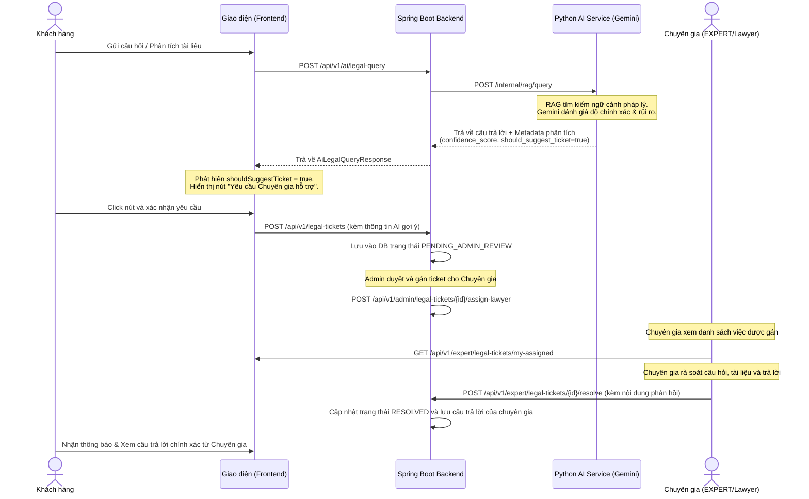

# Tài liệu Đặc tả Tính năng Legal Ticket (Bản Mở rộng & Đầy đủ)

Tài liệu này mô tả chi tiết cấu trúc Database Entity, các API endpoints (bao gồm cả các phần đề xuất bổ sung cho Chuyên gia) và luồng xử lý hoàn chỉnh của tính năng **Legal Ticket** (Vé hỗ trợ pháp lý từ chuyên gia).

---

## 1. Luồng Hoạt động Toàn diện (End-to-End Workflow)



---

## 2. Chi tiết Database Entity: `LegalTicket`

Bảng `legal_tickets` được cập nhật thêm trường phản hồi của Chuyên gia và cấu hình ràng buộc xóa dữ liệu liên quan.

### Thuộc tính & Quan hệ (JPA Entity Mapping)

| Tên thuộc tính Java | Kiểu dữ liệu | Tên cột Database | Ràng buộc / Mối quan hệ | Mô tả |
| :--- | :--- | :--- | :--- | :--- |
| `id` | `String` | `id` | `@Id`, Khóa chính | Sinh ngẫu nhiên với tiền tố `ticket_` |
| `requestId` | `String` | `request_id` | `VARCHAR(255)` | ID lượt query AI gốc phục vụ đối chiếu |
| `workspace` | `Workspace` | `workspace_id` | `@ManyToOne`, `nullable = false`<br>*(Cascade Delete)* | Liên kết đến Workspace. Nếu Workspace bị xóa, ticket tự động bị xóa theo. |
| `document` | `Document` | `document_id` | `@ManyToOne`, `nullable = true`<br>*(On Delete Set Null)* | Liên kết đến tài liệu liên quan. Nếu tài liệu bị xóa, cột này sẽ được set `NULL` (không xóa ticket). |
| `question` | `String` | `question` | `TEXT` | Nội dung câu hỏi gốc của người dùng |
| `answer` | `String` | `answer` | `TEXT` | Nội dung câu trả lời chưa tối ưu của AI |
| `confidenceScore` | `Double` | `confidence_score` | `DOUBLE PRECISION` | Điểm tin cậy của AI (0.0 đến 1.0) |
| `shouldSuggestTicket`| `Boolean` | `should_suggest_ticket`| `BOOLEAN` | Đánh dấu AI có đề xuất hỗ trợ hay không |
| `suggestionType` | `SuggestionType`| `suggestion_type` | `VARCHAR(50)`, Enum | Loại đề xuất (`NONE`, `ASK_MORE_INFO`, `SUGGEST_LAWYER`, `REQUIRE_LAWYER`) |
| `suggestionReason` | `String` | `suggestion_reason` | `TEXT` | Lý do AI đề xuất cần chuyên gia |
| `missingInformation`| `String` | `missing_information`| `TEXT` | Thông tin người dùng cần cung cấp thêm |
| `riskLevel` | `RiskLevel` | `risk_level` | `VARCHAR(50)`, Enum | Mức độ rủi ro pháp lý (`LOW`, `MEDIUM`, `HIGH`) |
| `legalDomain` | `String` | `legal_domain` | `VARCHAR(255)` | Lĩnh vực pháp lý do AI nhận diện |
| `userActionHint` | `UserActionHint`| `user_action_hint` | `VARCHAR(50)`, Enum | Gợi ý cho UI (`CONTINUE_CHAT`, `PROVIDE_MORE_INFO`, `CREATE_TICKET`) |
| `status` | `LegalTicketStatus`| `status` | `VARCHAR(50)`, Enum, `nullable = false` | Trạng thái ticket (`PENDING_ADMIN_REVIEW`, `ASSIGNED_TO_LAWYER`, `RESOLVED`, `CLOSED`) |
| `assignedLawyer` | `User` | `assigned_lawyer_id` | `@ManyToOne`, `nullable = true` | Chuyên gia được gán xử lý (Role: `EXPERT` hoặc `ADMIN`). Chỉ gán tối đa 1 chuyên gia xử lý 1 ticket. |
| `expertAnswer` | `String` | `expert_answer` | `TEXT`, `nullable = true` | **[MỚI]** Nội dung phản hồi pháp lý chính thức từ Chuyên gia sau khi rà soát. |
| `createdAt` | `LocalDateTime`| `created_at` | `TIMESTAMP`, `nullable = false` | Thời điểm tạo ticket |
| `updatedAt` | `LocalDateTime`| `updated_at` | `TIMESTAMP`, `nullable = false` | Thời điểm cập nhật gần nhất |

---

## 3. Danh sách REST API Endpoints hoàn chỉnh

Bao gồm các API gốc và 2 API đề xuất bổ sung phục vụ cho phân hệ Chuyên gia (`EXPERT`):

### 3.1. Các API dành cho Khách hàng (`CUSTOMER`) & Admin

* **POST `/api/v1/ai/legal-query`**
  * **Quyền**: `CUSTOMER`, `ADMIN`
  * **Mô tả**: Gửi câu hỏi pháp lý lên AI Service, trả về câu trả lời cùng các gợi ý ticket.

* **POST `/api/v1/legal-tickets`**
  * **Quyền**: `CUSTOMER`, `ADMIN`
  * **Mô tả**: Tạo ticket khi AI đề xuất hoặc độ tin cậy thấp.

* **GET `/api/v1/legal-tickets/{id}`**
  * **Quyền**: `CUSTOMER`, `ADMIN`
  * **Mô tả**: Xem thông tin chi tiết một ticket.

### 3.2. Các API dành cho Quản trị viên (`ADMIN`)

* **GET `/api/v1/admin/legal-tickets`**
  * **Quyền**: `ADMIN`
  * **Mô tả**: Lấy danh sách toàn bộ các ticket trong hệ thống.

* **POST `/api/v1/admin/legal-tickets/{id}/assign-lawyer?lawyerId={lawyerId}`**
  * **Quyền**: `ADMIN`
  * **Mô tả**: Gán một Chuyên gia xử lý ticket.

### 3.3. Các API đề xuất thêm dành cho Chuyên gia (`EXPERT`)

* **GET `/api/v1/expert/legal-tickets/my-assigned`**
  * **Quyền**: `EXPERT`
  * **Mô tả**: Lấy danh sách các ticket đã được gán cho chuyên gia đang đăng nhập để xử lý.

* **POST `/api/v1/expert/legal-tickets/{id}/resolve`**
  * **Quyền**: `EXPERT`
  * **Mô tả**: Chuyên gia gửi phản hồi chính thức cho ticket. Hệ thống lưu phản hồi vào trường `expertAnswer` và chuyển trạng thái ticket sang `RESOLVED`.
  * **Request Body**:
    ```json
    {
      "expert_answer": "Dựa trên quy định tại Điều 37 Luật Thương mại 2005, mức phạt vi phạm tối đa đối với các giao dịch thương mại thông thường là 8% giá trị phần nghĩa vụ hợp đồng bị vi phạm. Do đó, điều khoản phạt 30% trong hợp đồng của bạn là không hợp pháp. Bạn nên đàm phán lại điều khoản này về mức <= 8%."
    }
    ```

---

## 4. Kế hoạch Hiện thực hóa (Next Steps Checklist)

- [ ] **Tạo Entity class**: Tạo file `LegalTicket.java` trong thư mục `src/main/java/com/analyzer/api/entity/` (đã bao gồm trường `expertAnswer` và thiết lập Cascade delete).
- [ ] **Tạo Spring Data Repository**: Tạo file `LegalTicketRepository.java` kế thừa `JpaRepository`.
- [ ] **Cập nhật và bổ sung Service Implementation**:
  - [ ] Triển khai lưu/truy vấn DB thực tế cho `LegalTicketServiceImpl.java` và `AdminTicketAssignmentServiceImpl.java`.
  - [ ] **[MỚI]** Thêm phương thức `resolveTicket(String ticketId, String expertAnswer)` và `getMyAssignedTickets(Long expertId)` vào Service.
- [ ] **Bổ sung Controller Endpoints cho Expert**: Khai báo 2 endpoint cho Expert trong `LegalTicketController.java`.
- [ ] **Kiểm thử tự động sinh bảng**: Chạy ứng dụng để Hibernate tự động sinh bảng `legal_tickets` đúng cấu trúc trường mới.
- [ ] **Tích hợp API Frontend**: Liên kết giao diện gọi các API tương ứng bao gồm màn hình của khách hàng, admin và chuyên gia.
