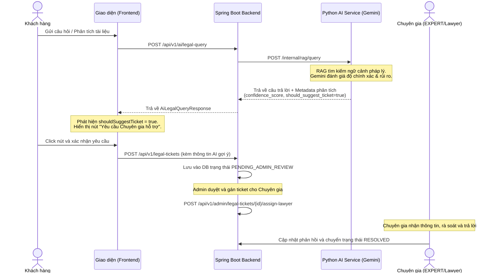

# Tài liệu Đặc tả Tính năng Legal Ticket (Hỗ trợ từ Chuyên gia)

Tài liệu này mô tả chi tiết cấu trúc Database Entity, các API endpoints và luồng xử lý của tính năng **Legal Ticket** (Vé hỗ trợ pháp lý từ chuyên gia) khi câu trả lời của AI có độ tin cậy thấp hoặc phát hiện rủi ro cao.

---

## 1. Luồng Hoạt động (Workflow)



---

## 2. Chi tiết Database Entity: `LegalTicket`

Thực thể này được lưu trong cơ sở dữ liệu để liên kết và quản lý trạng thái của các yêu cầu hỗ trợ.

### Thuộc tính & Quan hệ (JPA Entity Mapping)

| Tên thuộc tính Java | Kiểu dữ liệu | Tên cột Database | Ràng buộc / Mối quan hệ | Mô tả |
| :--- | :--- | :--- | :--- | :--- |
| `id` | `String` | `id` | `@Id`, Khóa chính | Sinh ngẫu nhiên với tiền tố `ticket_` |
| `requestId` | `String` | `request_id` | `VARCHAR(255)` | ID lượt query AI gốc phục vụ đối chiếu |
| `workspace` | `Workspace` | `workspace_id` | `@ManyToOne`, `nullable = false` | Liên kết đến Workspace chứa yêu cầu |
| `document` | `Document` | `document_id` | `@ManyToOne`, `nullable = true` | Liên kết đến tài liệu đang thảo luận (nếu có) |
| `question` | `String` | `question` | `TEXT` | Nội dung câu hỏi gốc của người dùng |
| `answer` | `String` | `answer` | `TEXT` | Nội dung câu trả lời chưa tối ưu của AI |
| `confidenceScore` | `Double` | `confidence_score` | `DOUBLE PRECISION` | Điểm tin cậy của AI (0.0 đến 1.0) |
| `shouldSuggestTicket`| `Boolean` | `should_suggest_ticket`| `BOOLEAN` | Đánh dấu AI có đề xuất hỗ trợ hay không |
| `suggestionType` | `SuggestionType`| `suggestion_type` | `VARCHAR(50)`, Enum | Loại đề xuất (`NONE`, `ASK_MORE_INFO`, `SUGGEST_LAWYER`, `REQUIRE_LAWYER`) |
| `suggestionReason` | `String` | `suggestion_reason` | `TEXT` | Lý do AI đề xuất cần chuyên gia |
| `missingInformation`| `String` | `missing_information`| `TEXT` | Thông tin người dùng cần cung cấp thêm |
| `riskLevel` | `RiskLevel` | `risk_level` | `VARCHAR(50)`, Enum | Mức độ rủi ro pháp lý (`LOW`, `MEDIUM`, `HIGH`) |
| `legalDomain` | `String` | `legal_domain` | `VARCHAR(255)` | Lĩnh vực pháp lý do AI nhận diện |
| `userActionHint` | `UserActionHint`| `user_action_hint` | `VARCHAR(50)`, Enum | Gợi ý cho UI (`CONTINUE_CHAT`, `PROVIDE_MORE_INFO`, `CREATE_TICKET`) |
| `status` | `LegalTicketStatus`| `status` | `VARCHAR(50)`, Enum, `nullable = false` | Trạng thái ticket (`PENDING_ADMIN_REVIEW`, `ASSIGNED_TO_LAWYER`, `RESOLVED`, `CLOSED`) |
| `assignedLawyer` | `User` | `assigned_lawyer_id` | `@ManyToOne`, `nullable = true` | Chuyên gia xử lý (Role: `EXPERT` hoặc `ADMIN`). Chỉ cho phép tối đa 1 chuyên gia xử lý 1 ticket (quan hệ `@ManyToOne`). |
| `createdAt` | `LocalDateTime`| `created_at` | `TIMESTAMP`, `nullable = false` | Thời điểm tạo ticket |
| `updatedAt` | `LocalDateTime`| `updated_at` | `TIMESTAMP`, `nullable = false` | Thời điểm cập nhật gần nhất |

---

## 3. Các REST API Endpoints Liên quan

Các API này đã được khai báo Controller ở commit `5ea09de`:

### 3.1. Chạy Truy vấn AI và Kiểm tra Đề xuất
* **Endpoint**: `POST /api/v1/ai/legal-query`
* **Quyền truy cập**: `CUSTOMER`, `ADMIN`
* **Mô tả**: Gửi câu hỏi pháp lý lên AI Service, trả về câu trả lời cùng các metadata để Frontend biết có nên hiển thị nút tạo ticket không.

### 3.2. Tạo Yêu cầu hỗ trợ (Legal Ticket)
* **Endpoint**: `POST /api/v1/legal-tickets`
* **Quyền truy cập**: `CUSTOMER`, `ADMIN`
* **Mô tả**: Gọi khi người dùng click xác nhận gửi yêu cầu cho chuyên gia.
* **Request Body** (`CreateLegalTicketRequest`):
  ```json
  {
    "request_id": "req_abc123",
    "workspace_id": "ws_xyz789",
    "document_id": "doc_def456",
    "question": "Điều khoản phạt vi phạm hợp đồng 30% có hợp pháp không?",
    "answer": "Theo luật thương mại Việt Nam...",
    "confidence_score": 0.55,
    "should_suggest_ticket": true,
    "suggestion_type": "SUGGEST_LAWYER",
    "suggestion_reason": "Điều khoản phạt vi phạm hợp đồng vượt quá mức trần quy định của Luật Thương mại (8%).",
    "missing_information": "Cần làm rõ hợp đồng thuộc lĩnh vực thương mại hay dân sự.",
    "risk_level": "HIGH",
    "legal_domain": "Luật Hợp Đồng",
    "user_action_hint": "CREATE_TICKET"
  }
  ```

### 3.3. Xem Chi tiết Ticket
* **Endpoint**: `GET /api/v1/legal-tickets/{id}`
* **Quyền truy cập**: `CUSTOMER`, `ADMIN`
* **Mô tả**: Xem thông tin chi tiết một ticket.

### 3.4. Lấy Danh sách Ticket (Dành cho Admin)
* **Endpoint**: `GET /api/v1/admin/legal-tickets`
* **Quyền truy cập**: `ADMIN`
* **Mô tả**: Lấy danh sách toàn bộ ticket để duyệt và phân công.

### 3.5. Gán Chuyên gia Xử lý
* **Endpoint**: `POST /api/v1/admin/legal-tickets/{id}/assign-lawyer?lawyerId={lawyerId}`
* **Quyền truy cập**: `ADMIN`
* **Mô tả**: Admin gán một Luật sư/Chuyên gia (tài khoản có role `EXPERT`) vào xử lý ticket. Chỉ được phép gán duy nhất 1 chuyên gia cho mỗi ticket.

---

## 4. Kế hoạch Hiện thực hóa (Next Steps Checklist)

Để tính năng này chạy được thực tế, bạn cần triển khai tiếp các bước sau:

- [ ] **Tạo Entity class**: Tạo file `LegalTicket.java` trong thư mục `src/main/java/com/analyzer/api/entity/` theo thiết kế trên.
- [ ] **Tạo Spring Data Repository**: Tạo file `LegalTicketRepository.java` kế thừa `JpaRepository` để giao tiếp database.
- [ ] **Cập nhật Service Implementation**:
  - [ ] Sửa `LegalTicketServiceImpl.java` để gọi repository thực tế thay vì trả dữ liệu mock.
  - [ ] Sửa `AdminTicketAssignmentServiceImpl.java` để cập nhật trạng thái gán chuyên gia vào cơ sở dữ liệu.
- [ ] **Kiểm thử tự động sinh bảng**: Khởi động ứng dụng để Hibernate tự động sinh bảng `legal_tickets` (do cấu hình `ddl-auto: update` có sẵn).
- [ ] **Tích hợp API Frontend**: Liên kết giao diện gọi các API tương ứng.
