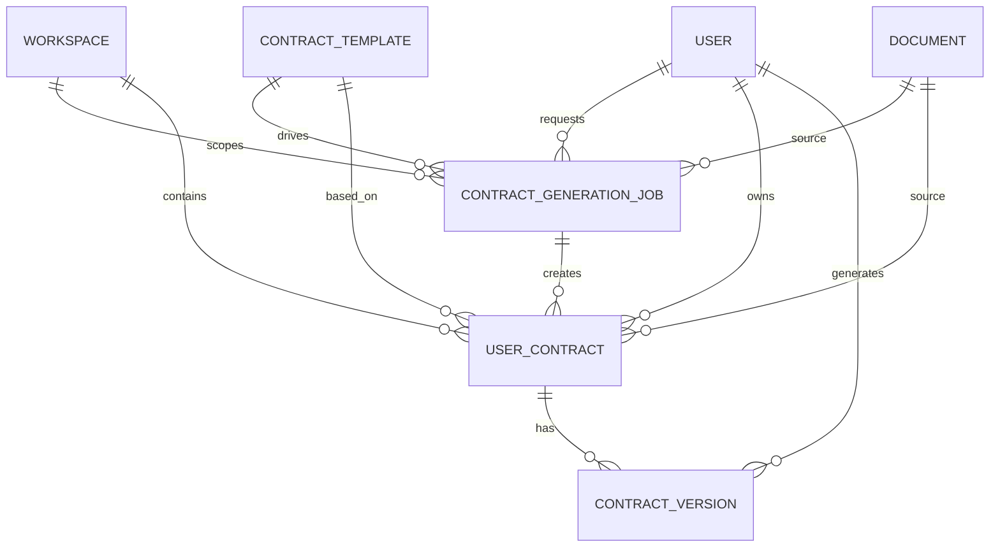
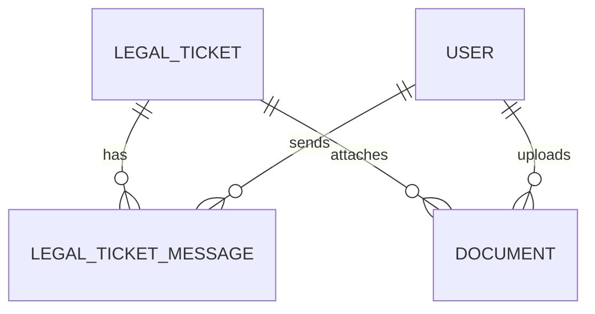
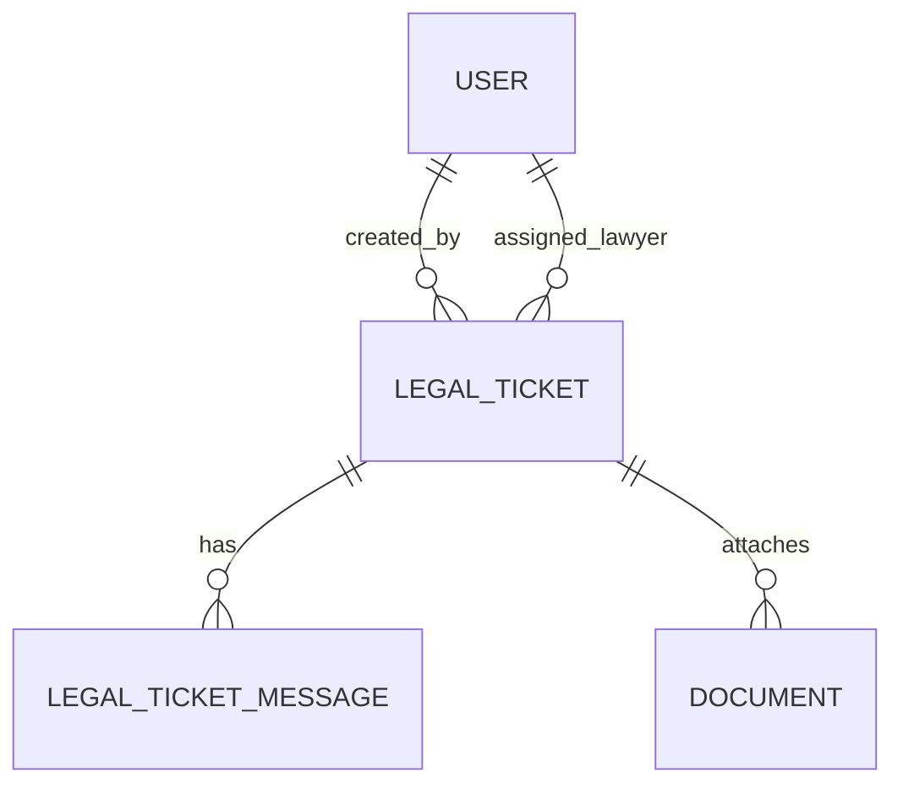
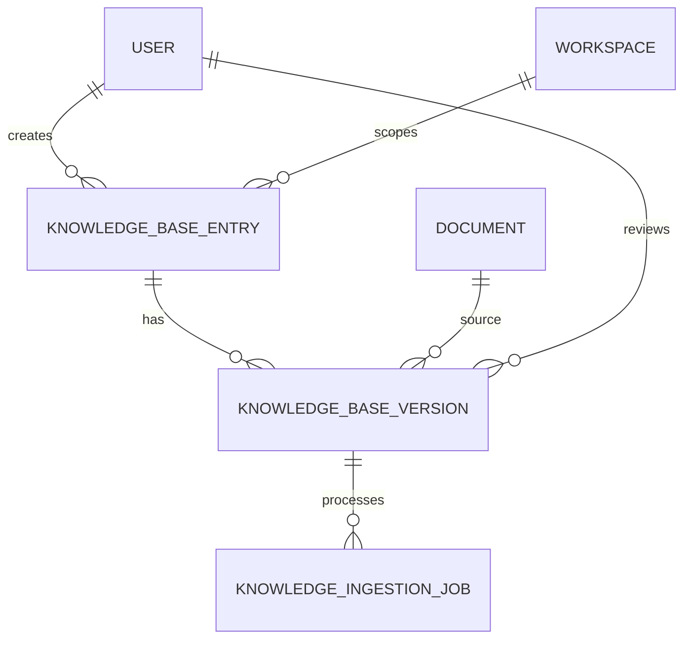
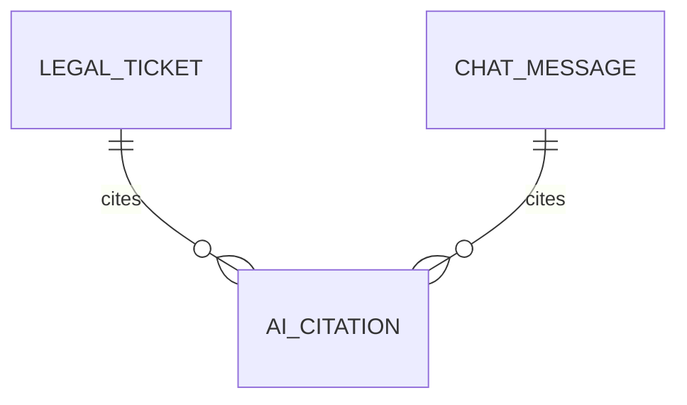
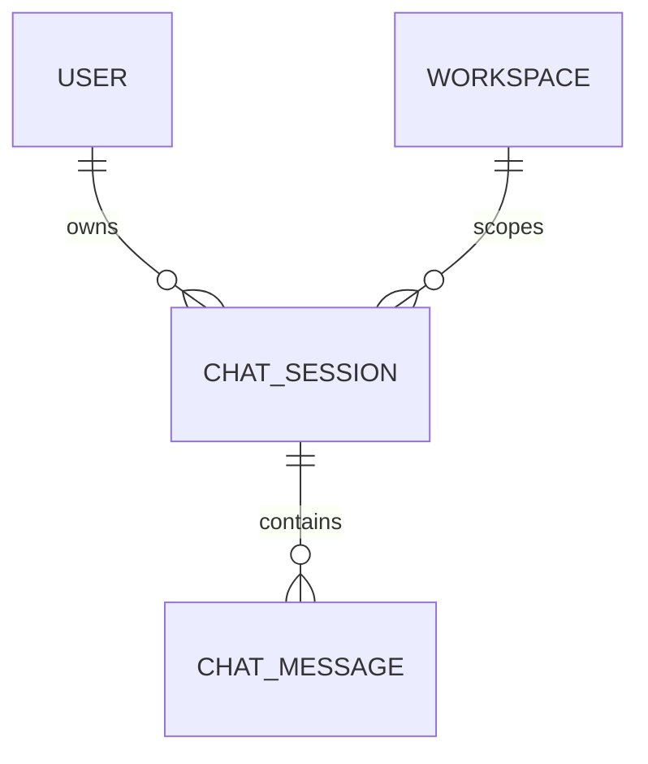
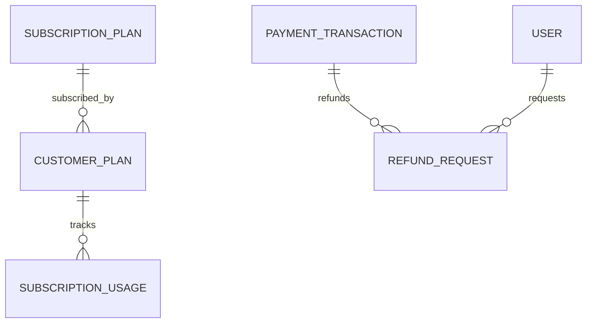
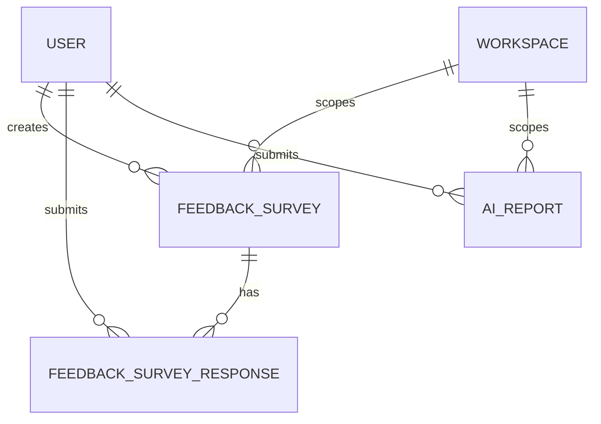

# Phase 2 Backend Contracts

Design-only contract for the new backend modules.  
No business logic, no SQL/JPQL, no security configuration, no mapper layer, no unit tests.

## 0. Current Project Conventions

- Package style in the repo is `com.analyzer.api.*`.
- Existing API responses use [`ApiResponseDTO`](../src/main/java/com/analyzer/api/dto/ApiResponseDTO.java) and [`PageResponse`](../src/main/java/com/analyzer/api/dto/PageResponse.java), not a `BaseResponse`.
- There is no `BaseEntity` in the current codebase. Existing entities manage `createdAt` / `updatedAt` locally. Phase 2 should follow the current pattern unless the team later introduces a shared mapped superclass.
- Reuse existing core entities and enums first:
  - `User`, `Role`, `Workspace`, `Document`
  - `LegalTicket`, `LegalTicketMessage`
  - `ChatSession`, `ChatMessage`
  - `SubscriptionPlan`, `CustomerPlan`, `PaymentTransaction`
  - `RiskLevel`, `SuggestionType`, `UserActionHint`
  - `LegalTicketStatus`, `LegalTicketMessageType`
  - `ChatSessionStatus`, `ChatMessageRole`, `ChatMessageStatus`, `ChatMessageType`
  - `PlanStatus`, `PaymentStatus`, `PaymentMethod`

## 1. Shared Design Rules

- Use Spring Boot 3, Java 21, JPA, Lombok, Jakarta Validation.
- Use `String` ids for business aggregates that need human-safe identifiers or prefixes.
- Use `Long` ids for small master/reference tables.
- Keep `@ManyToOne(fetch = FetchType.LAZY)` by default.
- Use `@Version` on mutable aggregates with concurrent admin/lawyer edits.
- Use soft delete fields only where audit history must be preserved.
- DTOs should stay thin and should not expose internal fields by default.
- Controller responses should always wrap payloads in `ApiResponseDTO`.

---

# 1. Contract Management

## 1.1 Entities

### `ContractTemplate`

| Field | Type | Relationship | Constraint |
|---|---|---|---|
| `id` | `Long` | PK | Generated |
| `templateCode` | `String` |  | Unique, not blank |
| `name` | `String` |  | Not blank |
| `description` | `String` |  | Nullable |
| `category` | `String` |  | Not blank |
| `jurisdiction` | `String` |  | Nullable |
| `content` | `String` |  | `TEXT`, not blank |
| `status` | `ContractTemplateStatus` |  | Not null |
| `version` | `Integer` |  | Default `1` |
| `createdAt` | `LocalDateTime` |  | Not null |
| `updatedAt` | `LocalDateTime` |  | Not null |

### `ContractGenerationJob`

| Field | Type | Relationship | Constraint |
|---|---|---|---|
| `id` | `String` | PK | Prefix-based id, e.g. `cg_...` |
| `requestId` | `String` |  | Unique, not blank |
| `requester` | `User` | `ManyToOne` | Not null |
| `workspace` | `Workspace` | `ManyToOne` | Not null |
| `template` | `ContractTemplate` | `ManyToOne` | Nullable |
| `sourceDocument` | `Document` | `ManyToOne` | Nullable |
| `inputJson` | `String` |  | `TEXT`, not blank |
| `promptSnapshot` | `String` |  | `TEXT`, nullable |
| `outputDraft` | `String` |  | `TEXT`, nullable |
| `status` | `ContractGenerationStatus` |  | Not null |
| `errorMessage` | `String` |  | `TEXT`, nullable |
| `createdAt` | `LocalDateTime` |  | Not null |
| `updatedAt` | `LocalDateTime` |  | Not null |

### `UserContract`

| Field | Type | Relationship | Constraint |
|---|---|---|---|
| `id` | `String` | PK | Prefix-based id, e.g. `contract_...` |
| `owner` | `User` | `ManyToOne` | Not null |
| `workspace` | `Workspace` | `ManyToOne` | Not null |
| `template` | `ContractTemplate` | `ManyToOne` | Nullable |
| `generationJob` | `ContractGenerationJob` | `ManyToOne` | Nullable |
| `sourceDocument` | `Document` | `ManyToOne` | Nullable |
| `title` | `String` |  | Not blank |
| `contractType` | `String` |  | Not blank |
| `status` | `ContractStatus` |  | Not null |
| `currentVersionNo` | `Integer` |  | Default `1` |
| `currentContentHash` | `String` |  | Nullable |
| `lastGeneratedAt` | `LocalDateTime` |  | Nullable |
| `createdAt` | `LocalDateTime` |  | Not null |
| `updatedAt` | `LocalDateTime` |  | Not null |

### `ContractVersion`

| Field | Type | Relationship | Constraint |
|---|---|---|---|
| `id` | `String` | PK | Prefix-based id, e.g. `cv_...` |
| `contract` | `UserContract` | `ManyToOne` | Not null |
| `versionNo` | `Integer` |  | Not null, unique per contract |
| `content` | `String` |  | `TEXT`, not blank |
| `changeSummary` | `String` |  | `TEXT`, nullable |
| `generatedBy` | `User` | `ManyToOne` | Nullable |
| `generatedByAi` | `Boolean` |  | Default `false` |
| `generationJob` | `ContractGenerationJob` | `ManyToOne` | Nullable |
| `createdAt` | `LocalDateTime` |  | Not null |

## 1.2 Enums

- `ContractTemplateStatus`: `ACTIVE`, `INACTIVE`, `ARCHIVED`
- `ContractGenerationStatus`: `QUEUED`, `PROCESSING`, `COMPLETED`, `FAILED`
- `ContractStatus`: `DRAFT`, `GENERATED`, `ACTIVE`, `ARCHIVED`

## 1.3 DTOs

- `CreateContractTemplateRequest`
- `UpdateContractTemplateRequest`
- `GenerateContractRequest`
- `SaveContractRequest`
- `ContractTemplateResponse`
- `ContractGenerationResponse`
- `ContractResponse`
- `ContractVersionResponse`
- `RevertContractVersionRequest`

## 1.4 Repository Interfaces

- `ContractTemplateRepository extends JpaRepository<ContractTemplate, Long>`
- `ContractGenerationJobRepository extends JpaRepository<ContractGenerationJob, String>`
- `UserContractRepository extends JpaRepository<UserContract, String>`
- `ContractVersionRepository extends JpaRepository<ContractVersion, String>`

## 1.5 Service Interfaces

- `ContractTemplateService`
- `ContractGenerationService`
- `UserContractService`
- `ContractVersionService`

## 1.6 Controller Endpoints

| Method | URL | Request DTO | Response DTO |
|---|---|---|---|
| `POST` | `/api/v1/contracts/templates` | `CreateContractTemplateRequest` | `ContractTemplateResponse` |
| `PUT` | `/api/v1/contracts/templates/{id}` | `UpdateContractTemplateRequest` | `ContractTemplateResponse` |
| `GET` | `/api/v1/contracts/templates` | none | `PageResponse<ContractTemplateResponse>` |
| `POST` | `/api/v1/contracts/generate` | `GenerateContractRequest` | `ContractGenerationResponse` |
| `GET` | `/api/v1/contracts/my` | none | `PageResponse<ContractResponse>` |
| `GET` | `/api/v1/contracts/{id}` | none | `ContractResponse` |
| `GET` | `/api/v1/contracts/{id}/versions` | none | `List<ContractVersionResponse>` |
| `POST` | `/api/v1/contracts/{id}/versions/{versionNo}/revert` | `RevertContractVersionRequest` | `ContractResponse` |
| `GET` | `/api/v1/contracts/{id}/download` | none | `Resource` or file response |

## 1.7 Validation

- `templateCode`, `name`, `category` must not be blank.
- `content` must not be blank and should have a max length agreed by product.
- `requestId` must not be blank and must be idempotent.
- `versionNo` must be positive and unique per contract.
- `title` must not be blank.

## 1.8 Relationships

- `ContractTemplate` 1 -> N `UserContract`
- `ContractGenerationJob` belongs to `User`, `Workspace`, optional `ContractTemplate`, optional `Document`
- `UserContract` belongs to `User`, `Workspace`, optional `ContractTemplate`, optional `ContractGenerationJob`, optional `Document`
- `UserContract` 1 -> N `ContractVersion`

## 1.9 Mermaid ERD

## 1.10 Workflow

- User selects a template or uploads a source document.
- Backend creates a generation job and stores a draft.
- AI output is saved as a new contract version.
- User edits, versions, downloads, or reverts contract versions.

## 1.11 TODOs

- Decide whether contract storage is global or workspace-scoped.
- Confirm if generated contract download should be PDF, DOCX, or both.
- Confirm whether version history is immutable after publish.

---

# 2. Lawyer Module

## 2.1 Entities

### Reuse existing

- `LegalTicket`
- `LegalTicketMessage`
- `Document`

### Existing entity changes

#### `Document`

Add the following contract fields:

| Field | Type | Relationship | Constraint |
|---|---|---|---|
| `legalTicket` | `LegalTicket` | `ManyToOne` | Nullable |
| `documentPurpose` | `String` |  | e.g. `USER_FILE`, `LAWYER_ATTACHMENT`, `ADMIN_ATTACHMENT` |
| `visibilityScope` | `String` |  | e.g. `CUSTOMER`, `LAWYER`, `ADMIN`, `ALL_INTERNAL` |

#### `LegalTicket`

Add the following contract fields:

| Field | Type | Relationship | Constraint |
|---|---|---|---|
| `closeReason` | `String` |  | `TEXT`, nullable |
| `lastCustomerMessageAt` | `LocalDateTime` |  | Nullable |
| `lastLawyerMessageAt` | `LocalDateTime` |  | Nullable |

## 2.2 Enums

- Reuse `LegalTicketStatus`
- Reuse `LegalTicketMessageType`
- Optional file visibility enum if the team prefers strict typing:
  - `DocumentVisibilityScope`: `CUSTOMER`, `LAWYER`, `ADMIN`, `ALL_INTERNAL`

## 2.3 DTOs

- `LawyerMyTicketResponse`
- `LawyerTicketDetailResponse`
- `LawyerTicketMessageResponse`
- `UploadTicketFileRequest`
- `TicketFileResponse`
- `CloseTicketRequest`
- `ChatWithUserRequest`
- `ChatWithUserResponse`

## 2.4 Repository Interfaces

- `LegalTicketRepository`
- `LegalTicketMessageRepository`
- `DocumentRepository`

## 2.5 Service Interfaces

- `LawyerTicketService`
- `LawyerTicketFileService`
- `LawyerTicketChatService`

## 2.6 Controller Endpoints

| Method | URL | Request DTO | Response DTO |
|---|---|---|---|
| `GET` | `/api/v1/lawyer/tickets/my` | none | `PageResponse<LawyerMyTicketResponse>` |
| `GET` | `/api/v1/lawyer/tickets/{id}` | none | `LawyerTicketDetailResponse` |
| `GET` | `/api/v1/lawyer/tickets/{id}/files` | none | `List<TicketFileResponse>` |
| `POST` | `/api/v1/lawyer/tickets/{id}/files/upload` | `UploadTicketFileRequest` | `TicketFileResponse` |
| `GET` | `/api/v1/lawyer/tickets/{id}/messages` | none | `List<LawyerTicketMessageResponse>` |
| `POST` | `/api/v1/lawyer/tickets/{id}/messages` | `ChatWithUserRequest` | `ChatWithUserResponse` |
| `POST` | `/api/v1/lawyer/tickets/{id}/close` | `CloseTicketRequest` | `LawyerTicketDetailResponse` |
| `GET` | `/api/v1/lawyer/tickets/{id}/download/{documentId}` | none | `Resource` or file response |

## 2.7 Validation

- Only the assigned lawyer can view or act on the ticket.
- Upload request must include a non-empty file payload or reference.
- Close ticket request must include a valid close reason when required by policy.
- Chat message content must not be blank.

## 2.8 Relationships

- `LegalTicket` 1 -> N `LegalTicketMessage`
- `LegalTicket` 1 -> N `Document`
- `Document` belongs to one `LegalTicket` when it is a ticket file

## 2.9 Mermaid ERD

## 2.10 Workflow

- Lawyer opens assigned tickets.
- Lawyer reviews ticket detail and attached files.
- Lawyer chats with the user through ticket messages.
- Lawyer uploads extra files when needed.
- Lawyer closes the ticket once the answer is ready.

## 2.11 TODOs

- Decide whether file upload uses `MultipartFile` contract or a storage reference contract.
- Confirm which ticket statuses allow lawyer chat and closure.
- Confirm whether internal notes stay in `LegalTicketMessage` or on `LegalTicket`.

---

# 3. Admin Ticket Management

## 3.1 Entities

### Reuse existing

- `LegalTicket`
- `LegalTicketMessage`
- `Document`

### Existing entity changes

- No extra entity is required if admin views reuse the same ticket/message/file tables.

## 3.2 Enums

- Reuse `LegalTicketStatus`
- Reuse `RiskLevel`
- Reuse `LegalTicketMessageType`

## 3.3 DTOs

- `AdminTicketListResponse`
- `AdminTicketDetailResponse`
- `AdminTicketSummaryResponse`
- `AdminChatHistoryResponse`
- `AdminUserFileResponse`
- `AssignLawyerRequest`
- `ReassignLawyerRequest`

## 3.4 Repository Interfaces

- `LegalTicketRepository`
- `LegalTicketMessageRepository`
- `DocumentRepository`

## 3.5 Service Interfaces

- `AdminTicketService`
- `AdminTicketAssignmentService`

## 3.6 Controller Endpoints

| Method | URL | Request DTO | Response DTO |
|---|---|---|---|
| `GET` | `/api/v1/admin/tickets` | none | `PageResponse<AdminTicketListResponse>` |
| `GET` | `/api/v1/admin/tickets/{id}` | none | `AdminTicketDetailResponse` |
| `GET` | `/api/v1/admin/tickets/{id}/summary` | none | `AdminTicketSummaryResponse` |
| `GET` | `/api/v1/admin/tickets/{id}/chat-history` | none | `AdminChatHistoryResponse` |
| `GET` | `/api/v1/admin/tickets/{id}/files` | none | `List<AdminUserFileResponse>` |
| `POST` | `/api/v1/admin/tickets/{id}/assign-lawyer` | `AssignLawyerRequest` | `AdminTicketDetailResponse` |
| `POST` | `/api/v1/admin/tickets/{id}/reassign-lawyer` | `ReassignLawyerRequest` | `AdminTicketDetailResponse` |

## 3.7 Validation

- Ticket must exist and not be deleted.
- Assigned lawyer must exist and have the lawyer role.
- Reassign must target a different lawyer when applicable.
- Admin should not assign closed/cancelled tickets.

## 3.8 Relationships

- Admin reads the same core `LegalTicket` aggregate.
- Summary and chat history are projections from `LegalTicket` and `LegalTicketMessage`.
- File view is a projection from `Document`.

## 3.9 Mermaid ERD

## 3.10 Workflow

- Admin opens the ticket queue.
- Admin inspects AI summary, chat history, and uploaded files.
- Admin assigns or reassigns a lawyer.
- Admin can reject, defer, or leave the ticket pending review.

## 3.11 TODOs

- Confirm whether admin summary is persisted or computed on demand.
- Confirm whether admin notes need a dedicated table or remain embedded in `LegalTicket`.

---

# 4. Knowledge Base Management

## 4.1 Entities

### `KnowledgeBaseEntry`

| Field | Type | Relationship | Constraint |
|---|---|---|---|
| `id` | `String` | PK | Prefix-based id, e.g. `kb_...` |
| `code` | `String` |  | Unique, not blank |
| `title` | `String` |  | Not blank |
| `category` | `String` |  | Not blank |
| `scope` | `KnowledgeScope` |  | Not null |
| `currentVersionNo` | `Integer` |  | Default `1` |
| `currentStatus` | `KnowledgeStatus` |  | Not null |
| `active` | `Boolean` |  | Default `true` |
| `createdBy` | `User` | `ManyToOne` | Not null |
| `workspace` | `Workspace` | `ManyToOne` | Nullable |
| `createdAt` | `LocalDateTime` |  | Not null |
| `updatedAt` | `LocalDateTime` |  | Not null |

### `KnowledgeBaseVersion`

| Field | Type | Relationship | Constraint |
|---|---|---|---|
| `id` | `String` | PK | Prefix-based id, e.g. `kbv_...` |
| `knowledgeBaseEntry` | `KnowledgeBaseEntry` | `ManyToOne` | Not null |
| `versionNo` | `Integer` |  | Not null, unique per entry |
| `sourceDocument` | `Document` | `ManyToOne` | Nullable |
| `rawContent` | `String` |  | `TEXT`, nullable |
| `extractedContent` | `String` |  | `TEXT`, not blank |
| `status` | `KnowledgeStatus` |  | Not null |
| `reviewDecision` | `KnowledgeReviewDecision` |  | Nullable |
| `reviewedBy` | `User` | `ManyToOne` | Nullable |
| `reviewedAt` | `LocalDateTime` |  | Nullable |
| `publishedBy` | `User` | `ManyToOne` | Nullable |
| `publishedAt` | `LocalDateTime` |  | Nullable |
| `archivedBy` | `User` | `ManyToOne` | Nullable |
| `archivedAt` | `LocalDateTime` |  | Nullable |
| `failedReason` | `String` |  | `TEXT`, nullable |
| `createdAt` | `LocalDateTime` |  | Not null |
| `updatedAt` | `LocalDateTime` |  | Not null |

### `KnowledgeIngestionJob`

| Field | Type | Relationship | Constraint |
|---|---|---|---|
| `id` | `String` | PK | Prefix-based id, e.g. `kij_...` |
| `knowledgeBaseVersion` | `KnowledgeBaseVersion` | `ManyToOne` | Not null |
| `requestId` | `String` |  | Unique, not blank |
| `status` | `KnowledgeStatus` |  | Not null |
| `jobPayload` | `String` |  | `TEXT`, nullable |
| `errorMessage` | `String` |  | `TEXT`, nullable |
| `startedAt` | `LocalDateTime` |  | Nullable |
| `completedAt` | `LocalDateTime` |  | Nullable |
| `createdAt` | `LocalDateTime` |  | Not null |

## 4.2 Enums

- `KnowledgeStatus`: `UPLOADED`, `PROCESSING`, `INGESTED`, `REVIEWING`, `PUBLIC`, `ARCHIVED`, `FAILED`
- `KnowledgeScope`: `GLOBAL`, `WORKSPACE`
- `KnowledgeReviewDecision`: `APPROVE`, `REQUEST_CHANGES`, `REJECT`

## 4.3 DTOs

- `UploadKnowledgeRequest`
- `IngestKnowledgeRequest`
- `KnowledgeReviewRequest`
- `PublishKnowledgeRequest`
- `ArchiveKnowledgeRequest`
- `KnowledgeBaseEntryResponse`
- `KnowledgeBaseVersionResponse`
- `KnowledgeIngestionJobResponse`

## 4.4 Repository Interfaces

- `KnowledgeBaseEntryRepository`
- `KnowledgeBaseVersionRepository`
- `KnowledgeIngestionJobRepository`

## 4.5 Service Interfaces

- `KnowledgeUploadService`
- `KnowledgeIngestionService`
- `KnowledgeReviewService`
- `KnowledgePublicationService`
- `KnowledgeArchiveService`

## 4.6 Controller Endpoints

| Method | URL | Request DTO | Response DTO |
|---|---|---|---|
| `POST` | `/api/v1/admin/knowledge-base/upload` | `UploadKnowledgeRequest` | `KnowledgeBaseVersionResponse` |
| `POST` | `/api/v1/admin/knowledge-base/{id}/ingest` | `IngestKnowledgeRequest` | `KnowledgeIngestionJobResponse` |
| `GET` | `/api/v1/admin/knowledge-base` | none | `PageResponse<KnowledgeBaseEntryResponse>` |
| `GET` | `/api/v1/admin/knowledge-base/{id}` | none | `KnowledgeBaseEntryResponse` |
| `GET` | `/api/v1/admin/knowledge-base/{id}/versions` | none | `List<KnowledgeBaseVersionResponse>` |
| `POST` | `/api/v1/admin/knowledge-base/{id}/review` | `KnowledgeReviewRequest` | `KnowledgeBaseVersionResponse` |
| `POST` | `/api/v1/admin/knowledge-base/{id}/publish` | `PublishKnowledgeRequest` | `KnowledgeBaseVersionResponse` |
| `POST` | `/api/v1/admin/knowledge-base/{id}/archive` | `ArchiveKnowledgeRequest` | `KnowledgeBaseVersionResponse` |

## 4.7 Validation

- Upload payload must include a title and source file or text.
- Version numbers must be positive and unique per knowledge entry.
- Only `PUBLIC` versions are usable by the AI retrieval layer.
- Archiving must preserve historical versions.

## 4.8 Relationships

- `KnowledgeBaseEntry` 1 -> N `KnowledgeBaseVersion`
- `KnowledgeBaseVersion` 1 -> N `KnowledgeIngestionJob`
- `KnowledgeBaseVersion` may originate from `Document`

## 4.9 Mermaid ERD

## 4.10 Workflow

- Admin uploads a knowledge source.
- Backend creates a version in `UPLOADED` or `PROCESSING`.
- Ingestion converts source data into searchable content.
- Admin reviews and publishes the version.
- Published knowledge can later be archived or superseded by a new version.

## 4.11 TODOs

- Confirm whether knowledge is global-only or workspace-specific.
- Confirm whether ingestion is synchronous or async via job status.
- Confirm whether `PUBLIC` is the only AI-visible status.

---

# 5. AI Features

## 5.1 Entities

### `AiCitation`

| Field | Type | Relationship | Constraint |
|---|---|---|---|
| `id` | `String` | PK | Prefix-based id, e.g. `cit_...` |
| `sourceType` | `CitationSourceType` |  | Not null |
| `sourceReferenceId` | `String` |  | Not blank |
| `label` | `String` |  | Not blank |
| `excerpt` | `String` |  | `TEXT`, nullable |
| `pageNumber` | `Integer` |  | Nullable |
| `chunkIndex` | `Integer` |  | Nullable |
| `score` | `Double` |  | Nullable |
| `uri` | `String` |  | Nullable |
| `legalTicket` | `LegalTicket` | `ManyToOne` | Nullable |
| `chatMessage` | `ChatMessage` | `ManyToOne` | Nullable |
| `createdAt` | `LocalDateTime` |  | Not null |

### Existing entity changes

- `LegalTicket`: add a citation metadata field, if the team prefers a denormalized snapshot.
- `ChatMessage`: add a citation metadata field, if the team prefers a denormalized snapshot.

## 5.2 Enums

- Reuse `RiskLevel`
- Reuse `SuggestionType`
- Reuse `UserActionHint`
- `CitationSourceType`: `DOCUMENT`, `KNOWLEDGE_BASE`, `CONTRACT`, `CHAT_MESSAGE`, `LEGAL_TICKET`

## 5.3 DTOs

- `AiRiskAssessmentResponse`
- `AiSuggestionResponse`
- `AiCitationResponse`
- `CitationMetadataResponse`
- `AiFeatureSummaryResponse`

## 5.4 Repository Interfaces

- `AiCitationRepository`

## 5.5 Service Interfaces

- `AiFeatureService`
- `AiCitationService`

## 5.6 Controller Endpoints

| Method | URL | Request DTO | Response DTO |
|---|---|---|---|
| `GET` | `/api/v1/ai/tickets/{ticketId}/assessment` | none | `AiRiskAssessmentResponse` |
| `GET` | `/api/v1/ai/tickets/{ticketId}/citations` | none | `List<AiCitationResponse>` |
| `GET` | `/api/v1/ai/chats/{chatMessageId}/citations` | none | `List<AiCitationResponse>` |
| `GET` | `/api/v1/ai/tickets/{ticketId}/summary` | none | `AiFeatureSummaryResponse` |

## 5.7 Validation

- Confidence score must stay in the `0.0` to `1.0` range.
- Risk level must use the shared enum only.
- Citation source reference must be non-empty.

## 5.8 Relationships

- `AiCitation` can attach to either a `LegalTicket` or a `ChatMessage`
- Citations can also refer to an external source id coming from knowledge base, contract, or document analysis

## 5.9 Mermaid ERD

## 5.10 Workflow

- AI produces an answer and a confidence score.
- Backend stores citation metadata beside the answer payload.
- UI can render citations for a ticket or chat message.

## 5.11 TODOs

- Decide whether citations are normalized in `AiCitation` only or also snapshotted into ticket/message text fields.
- Decide whether AI feature endpoints are public API or internal API only.

---

# 6. Chat Session

## 6.1 Entities

### Existing entity changes

#### `ChatSession`

| Field | Type | Relationship | Constraint |
|---|---|---|---|
| `summary` | `String` |  | `TEXT`, nullable |
| `summaryUpdatedAt` | `LocalDateTime` |  | Nullable |
| `memoryJson` | `String` |  | `TEXT`, nullable |
| `contextJson` | `String` |  | `TEXT`, nullable |
| `contextVersion` | `Long` |  | Default `1` |

#### `ChatMessage`

| Field | Type | Relationship | Constraint |
|---|---|---|---|
| `citationMetadataJson` | `String` |  | `TEXT`, nullable |
| `contextSnapshotJson` | `String` |  | `TEXT`, nullable |

## 6.2 Enums

- Reuse `ChatSessionStatus`
- Reuse `ChatMessageRole`
- Reuse `ChatMessageStatus`
- Reuse `ChatMessageType`

## 6.3 DTOs

- `CreateChatSessionRequest`
- `UpdateChatSessionRequest`
- `ChatSessionResponse`
- `ChatSessionSummaryResponse`
- `ChatSessionMemoryResponse`
- `ChatMessageResponse`
- `AppendChatContextRequest`

## 6.4 Repository Interfaces

- `ChatSessionRepository`
- `ChatMessageRepository`

## 6.5 Service Interfaces

- `ChatSessionService`
- `ChatMessageService`
- `ChatMemoryService`

## 6.6 Controller Endpoints

| Method | URL | Request DTO | Response DTO |
|---|---|---|---|
| `POST` | `/api/v1/chat-sessions` | `CreateChatSessionRequest` | `ChatSessionResponse` |
| `GET` | `/api/v1/chat-sessions/{id}` | none | `ChatSessionResponse` |
| `PUT` | `/api/v1/chat-sessions/{id}` | `UpdateChatSessionRequest` | `ChatSessionResponse` |
| `GET` | `/api/v1/chat-sessions/{id}/summary` | none | `ChatSessionSummaryResponse` |
| `GET` | `/api/v1/chat-sessions/{id}/messages` | none | `List<ChatMessageResponse>` |
| `POST` | `/api/v1/chat-sessions/{id}/context` | `AppendChatContextRequest` | `ChatSessionMemoryResponse` |

## 6.7 Validation

- Session title must not be blank when provided.
- Summary and memory payloads should be capped to product-defined sizes.
- Context JSON must be valid JSON if the implementation stores structured context.

## 6.8 Relationships

- `ChatSession` 1 -> N `ChatMessage`
- `ChatSession` belongs to `User` and `Workspace`

## 6.9 Mermaid ERD

## 6.10 Workflow

- User starts a chat session.
- Messages are appended to the session.
- Backend keeps memory, context, and summary snapshots.
- UI can reopen a session and continue with preserved context.

## 6.11 TODOs

- Confirm whether memory storage is JSON, normalized tables, or both.
- Confirm the summary refresh policy.
- Confirm whether deleted sessions should keep message history.

---

# 7. Subscription

## 7.1 Entities

### Existing entity changes

#### `SubscriptionPlan`

| Field | Type | Relationship | Constraint |
|---|---|---|---|
| `planType` | `SubscriptionTier` |  | Replace string with enum |
| `featureLimitsJson` | `String` |  | `TEXT`, nullable |
| `aiQuota` | `Integer` |  | Nullable |
| `ticketQuota` | `Integer` |  | Nullable |

#### `CustomerPlan`

| Field | Type | Relationship | Constraint |
|---|---|---|---|
| `usageStartAt` | `LocalDateTime` |  | Nullable |
| `usageEndAt` | `LocalDateTime` |  | Nullable |
| `billingCycleStartAt` | `LocalDateTime` |  | Nullable |
| `billingCycleEndAt` | `LocalDateTime` |  | Nullable |
| `cancelReason` | `String` |  | `TEXT`, nullable |

### `SubscriptionUsage`

| Field | Type | Relationship | Constraint |
|---|---|---|---|
| `id` | `Long` | PK | Generated |
| `customerPlan` | `CustomerPlan` | `ManyToOne` | Not null |
| `usageType` | `UsageEventType` |  | Not null |
| `referenceId` | `String` |  | Nullable |
| `consumedUnits` | `Integer` |  | Not null |
| `metadataJson` | `String` |  | `TEXT`, nullable |
| `createdAt` | `LocalDateTime` |  | Not null |

### `RefundRequest`

| Field | Type | Relationship | Constraint |
|---|---|---|---|
| `id` | `Long` | PK | Generated |
| `paymentTransaction` | `PaymentTransaction` | `ManyToOne` | Not null |
| `customerPlan` | `CustomerPlan` | `ManyToOne` | Nullable |
| `requestedBy` | `User` | `ManyToOne` | Not null |
| `reason` | `String` |  | `TEXT`, not blank |
| `status` | `RefundStatus` |  | Not null |
| `amount` | `BigDecimal` |  | Not null |
| `adminNote` | `String` |  | `TEXT`, nullable |
| `createdAt` | `LocalDateTime` |  | Not null |
| `updatedAt` | `LocalDateTime` |  | Not null |

## 7.2 Enums

- `SubscriptionTier`: `BASIC`, `PRO`, `PREMIUM`
- `UsageEventType`: `AI_QUERY`, `CONTRACT_GENERATION`, `TICKET_CREATE`, `KNOWLEDGE_SEARCH`, `CHAT_MESSAGE`
- `RefundStatus`: `REQUESTED`, `APPROVED`, `REJECTED`, `PROCESSING`, `COMPLETED`

## 7.3 DTOs

- `SubscriptionPlanRequestDTO`
- `SubscriptionPlanResponseDTO`
- `SubscribeRequestDTO`
- `CustomerPlanResponseDTO`
- `SubscriptionUsageResponse`
- `RefundRequestDTO`
- `RefundResponseDTO`

## 7.4 Repository Interfaces

- `SubscriptionPlanRepository`
- `CustomerPlanRepository`
- `SubscriptionUsageRepository`
- `RefundRequestRepository`

## 7.5 Service Interfaces

- `SubscriptionPlanService`
- `CustomerPlanService`
- `SubscriptionUsageService`
- `RefundService`

## 7.6 Controller Endpoints

| Method | URL | Request DTO | Response DTO |
|---|---|---|---|
| `GET` | `/api/v1/subscriptions/plans` | none | `List<SubscriptionPlanResponseDTO>` |
| `POST` | `/api/v1/subscriptions/subscribe` | `SubscribeRequestDTO` | `CustomerPlanResponseDTO` |
| `GET` | `/api/v1/subscriptions/my-plan` | none | `CustomerPlanResponseDTO` |
| `GET` | `/api/v1/subscriptions/my-usage` | none | `PageResponse<SubscriptionUsageResponse>` |
| `POST` | `/api/v1/subscriptions/refunds` | `RefundRequestDTO` | `RefundResponseDTO` |
| `GET` | `/api/v1/subscriptions/refunds/{id}` | none | `RefundResponseDTO` |

## 7.7 Validation

- Plan tier must be one of the shared enum values.
- Usage tracking rows must not accept negative units.
- Refund reason must not be blank.
- Refund amount must be positive and should not exceed paid amount.

## 7.8 Relationships

- `SubscriptionPlan` 1 -> N `CustomerPlan`
- `CustomerPlan` 1 -> N `SubscriptionUsage`
- `PaymentTransaction` 1 -> N `RefundRequest`
- `RefundRequest` may be linked to a `CustomerPlan`

## 7.9 Mermaid ERD

## 7.10 Workflow

- User selects a plan and subscribes.
- Backend activates the customer plan and starts usage tracking.
- Usage rows accumulate for billable actions.
- User or admin can submit a refund request tied to the original payment.

## 7.11 TODOs

- Confirm whether usage is per month, per billing cycle, or lifetime.
- Confirm whether refund requests require approval workflow or auto-processing.
- Confirm if plan limits differ by feature or only by a single quota field.

---

# 8. User Feedback

## 8.1 Entities

### `FeedbackSurvey`

| Field | Type | Relationship | Constraint |
|---|---|---|---|
| `id` | `String` | PK | Prefix-based id, e.g. `fs_...` |
| `code` | `String` |  | Unique, not blank |
| `title` | `String` |  | Not blank |
| `description` | `String` |  | `TEXT`, nullable |
| `surveyType` | `FeedbackSurveyType` |  | Not null |
| `status` | `FeedbackSurveyStatus` |  | Not null |
| `targetType` | `String` |  | e.g. `CHAT`, `TICKET`, `CONTRACT` |
| `createdBy` | `User` | `ManyToOne` | Not null |
| `workspace` | `Workspace` | `ManyToOne` | Nullable |
| `createdAt` | `LocalDateTime` |  | Not null |
| `updatedAt` | `LocalDateTime` |  | Not null |

### `FeedbackSurveyResponse`

| Field | Type | Relationship | Constraint |
|---|---|---|---|
| `id` | `String` | PK | Prefix-based id, e.g. `fsr_...` |
| `survey` | `FeedbackSurvey` | `ManyToOne` | Not null |
| `respondent` | `User` | `ManyToOne` | Nullable |
| `sourceReferenceId` | `String` |  | Nullable |
| `rating` | `Integer` |  | Nullable |
| `answerJson` | `String` |  | `TEXT`, nullable |
| `comment` | `String` |  | `TEXT`, nullable |
| `createdAt` | `LocalDateTime` |  | Not null |

### `AiReport`

| Field | Type | Relationship | Constraint |
|---|---|---|---|
| `id` | `String` | PK | Prefix-based id, e.g. `air_...` |
| `reportType` | `String` |  | Not blank |
| `sourceType` | `String` |  | e.g. `CHAT_MESSAGE`, `LEGAL_TICKET`, `CONTRACT`, `KNOWLEDGE_BASE` |
| `sourceReferenceId` | `String` |  | Not blank |
| `summary` | `String` |  | `TEXT`, not blank |
| `detailsJson` | `String` |  | `TEXT`, nullable |
| `submittedBy` | `User` | `ManyToOne` | Nullable |
| `workspace` | `Workspace` | `ManyToOne` | Nullable |
| `status` | `AiReportStatus` |  | Not null |
| `createdAt` | `LocalDateTime` |  | Not null |
| `updatedAt` | `LocalDateTime` |  | Not null |

## 8.2 Enums

- `FeedbackSurveyType`: `SATISFACTION`, `PRODUCT`, `BUG`, `USABILITY`
- `FeedbackSurveyStatus`: `DRAFT`, `ACTIVE`, `CLOSED`, `ARCHIVED`
- `AiReportStatus`: `OPEN`, `UNDER_REVIEW`, `RESOLVED`, `REJECTED`

## 8.3 DTOs

- `CreateSurveyRequest`
- `UpdateSurveyRequest`
- `SurveyResponseDTO`
- `SubmitSurveyResponseRequest`
- `AiReportCreateRequest`
- `AiReportResponse`

## 8.4 Repository Interfaces

- `FeedbackSurveyRepository`
- `FeedbackSurveyResponseRepository`
- `AiReportRepository`

## 8.5 Service Interfaces

- `FeedbackSurveyService`
- `FeedbackSurveyResponseService`
- `AiReportService`

## 8.6 Controller Endpoints

| Method | URL | Request DTO | Response DTO |
|---|---|---|---|
| `POST` | `/api/v1/admin/feedback/surveys` | `CreateSurveyRequest` | `SurveyResponseDTO` |
| `PUT` | `/api/v1/admin/feedback/surveys/{id}` | `UpdateSurveyRequest` | `SurveyResponseDTO` |
| `GET` | `/api/v1/admin/feedback/surveys` | none | `PageResponse<SurveyResponseDTO>` |
| `POST` | `/api/v1/feedback/surveys/{id}/responses` | `SubmitSurveyResponseRequest` | `AiReportResponse` |
| `POST` | `/api/v1/feedback/ai-reports` | `AiReportCreateRequest` | `AiReportResponse` |
| `GET` | `/api/v1/admin/feedback/ai-reports` | none | `PageResponse<AiReportResponse>` |

## 8.7 Validation

- Survey title must not be blank.
- Response rating should be within the product-defined range.
- AI report summary must not be blank.
- Source reference must always be present for AI reports.

## 8.8 Relationships

- `FeedbackSurvey` 1 -> N `FeedbackSurveyResponse`
- `AiReport` belongs to optional `User` and `Workspace`

## 8.9 Mermaid ERD

## 8.10 Workflow

- Admin publishes a survey.
- User submits survey feedback.
- User or system creates an AI report when something needs review.
- Admin processes the AI report and closes it when done.

## 8.11 TODOs

- Confirm if survey questions should be normalized into a separate entity.
- Confirm whether AI reports should be linked to tickets, chats, contracts, or knowledge items by FK instead of generic reference ids.

---

# 9. Final Notes

- Existing entities should be extended before adding near-duplicate tables.
- Keep the package layout close to the current codebase.
- Prefer repository and service interfaces only in Phase 2.
- Keep response contracts aligned with `ApiResponseDTO` and `PageResponse`.
- Do not add `ServiceImpl`, repository implementations, security code, mapper code, or tests in this design phase.
