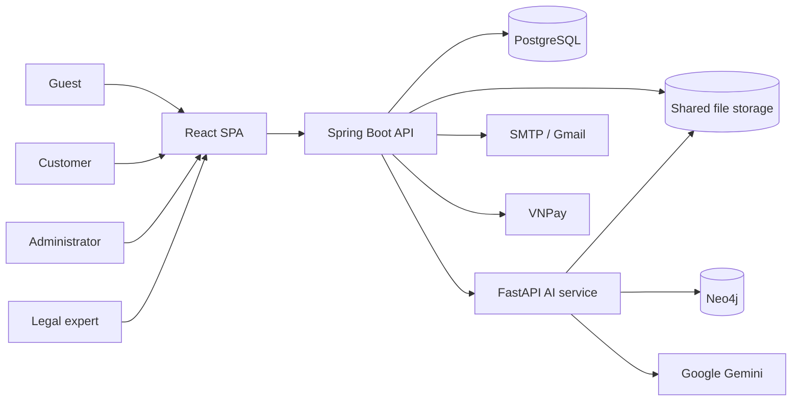
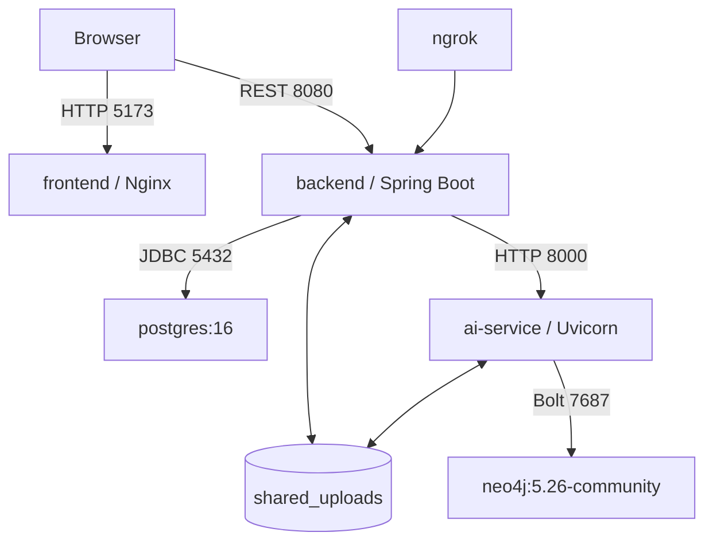
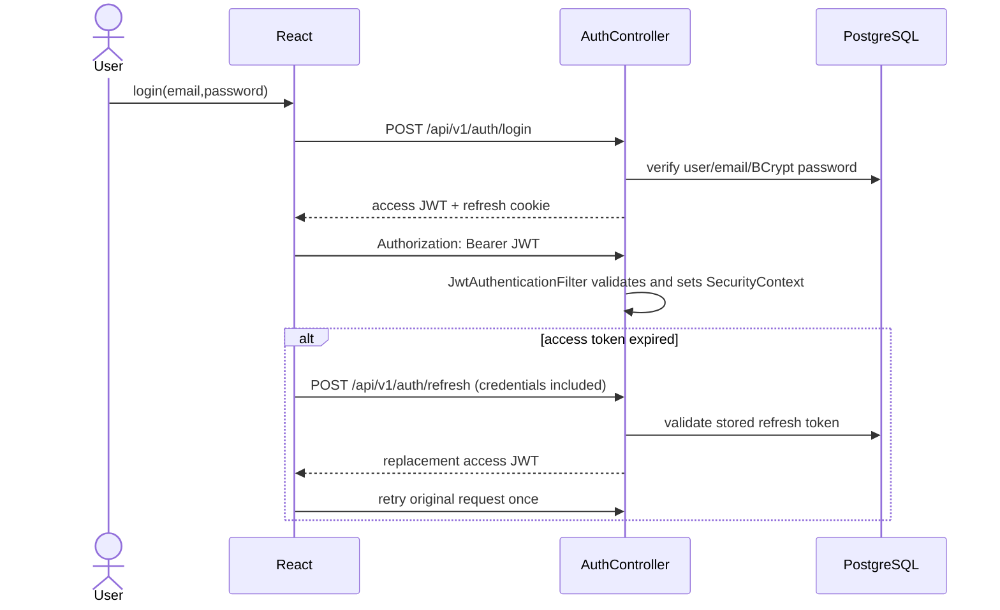
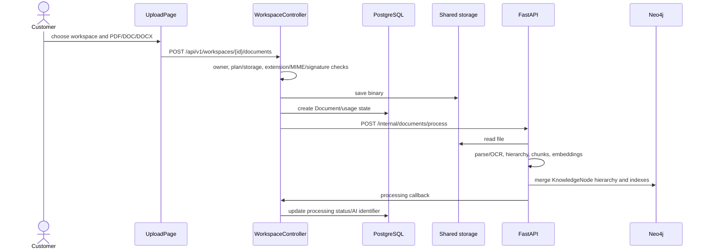
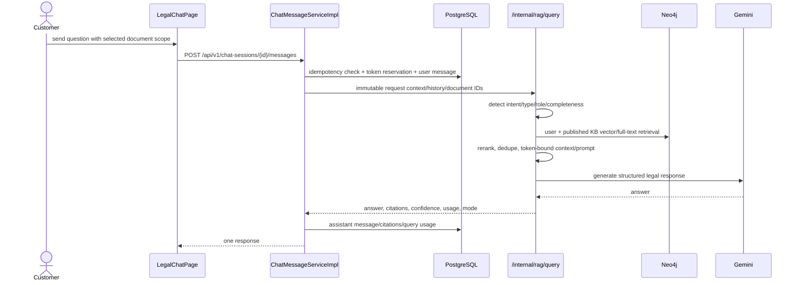
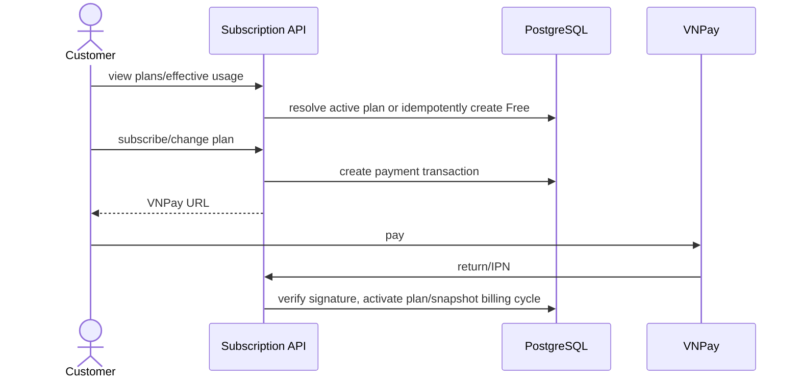

# Architecture report

## System context



## Containers



Evidence: `docker-compose.yml`, `frontend/nginx.conf`, `backend/src/main/resources/application.yml`, and `ai-service/app/core/config.py`. The browser has environment entries for direct AI URLs, but principal product flows go through the backend; direct AI pages are a coupling risk.

## Authentication



Registration records accepted policy versions, hashes the password, sends an email-verification token, and blocks login until verified (`AuthServiceImpl`). Route rules authenticate by default; controllers add `@PreAuthorize` for roles.

## Document upload and ingestion



The callback and all `/api/internal/**` routes are network-trust based and presently `permitAll`; no shared-secret signature was found in `SecurityConfig`.

## Knowledge publication

Admin upload creates `KnowledgeBaseEntry`, `KnowledgeBaseVersion`, and `KnowledgeIngestionJob`; dispatcher calls AI ingestion; AI writes Neo4j and callback state stores `aiDocumentId`. Admin review/publish/unpublish/archive changes PostgreSQL lifecycle state. Retrieval applies metadata/visibility filtering in `knowledge_access.py`. Publication and Neo4j writes are not one distributed transaction, so repair endpoints exist.

## AI legal query



Rule shortcuts can answer greetings/capabilities without RAG. Missing documents do not universally block general legal guidance; document-analysis intents may ask for more information. Failures from AI are mapped by `PythonAiClient`/global handlers; Gemini has retries/fallback, while the Java client has timeouts but no general retry loop.

## Contract analysis and drafting redirect

Analysis is the same chat pipeline with document-scoped intents such as summary, risk, clause extraction and missing clauses. Drafting intent can return a structured `DraftingWorkflowCard`; the frontend can collect facts, copy a sanitized prompt, and open ChatGPT. This is a prompt handoff, not a server-to-ChatGPT API integration. A separate `/api/v1/contracts/generate` → AI `/v2/contracts/generate` flow persists generation jobs/contracts/versions; the two paths overlap and should not be presented as one guaranteed journey.

## Expert ticket

```mermaid
sequenceDiagram
  actor C as Customer
  participant B as LegalTicketController
  participant P as PostgreSQL
  actor A as Admin
  actor E as Expert
  C->>B: create support/expert ticket
  B->>P: enforce plan/ticket credit; snapshot context
  A->>B: classify and quote
  alt paid ticket
    C->>B: request VNPay URL / confirm payment callback
  end
  A->>B: offer assignment
  E->>B: accept or decline
  E->>B: review, message, request info, resolve
  C->>B: reply, close or eligible reopen
  B->>P: state, files, messages, audit, revenue items
```

Free users can create up to three system/query-error support tickets; expert contact is restricted to Premium or an explicit payment/credit workflow (`SubscriptionQuotaServiceImpl`, `LegalTicketServiceImpl`). Admin and expert endpoints are role-protected.

## Subscription and payment



Quota uses the effective active plan snapshot: AI tokens and storage are metered; workspace count, document count, analysis count and contract drafts are explicitly retired in `SubscriptionQuotaServiceImpl`. Plan defaults are Free 50,000 tokens/50 MB, Standard 1,500,000/1,024 MB, Premium 8,500,000/5,120 MB and one expert ticket. Database-managed plans override seeds.

## Email, revenue and background work

`EmailServiceImpl` sends verification/reset, ingestion, ticket, refund, expert-account and finance notifications. Revenue periods/statements/items are calculated/closed; commission changes require emailed verification; early payout moves through admin decisions and payment marking; Apache POI exports XLSX. `RevenuePayrollScheduler` retries notifications every six hours and SLA scheduler handles ticket deadlines. These flows require SMTP, consistent timezone (`Asia/Ho_Chi_Minh`), and database seed/settings; full external delivery was not exercised.
